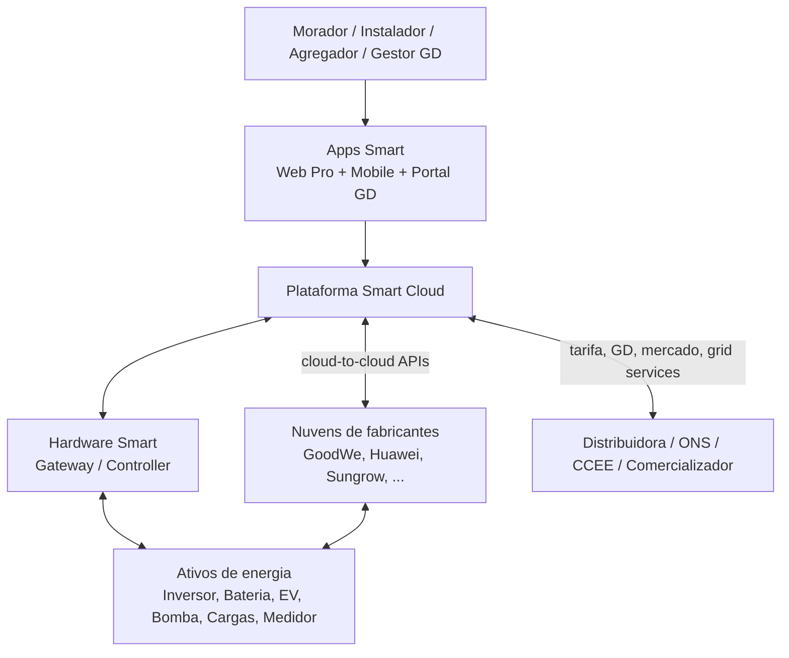
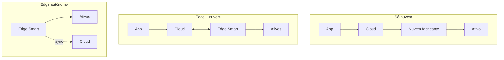
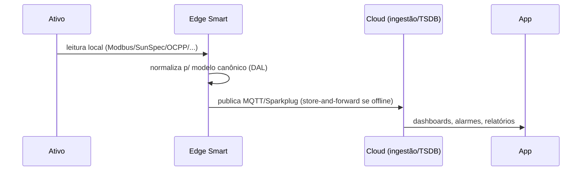
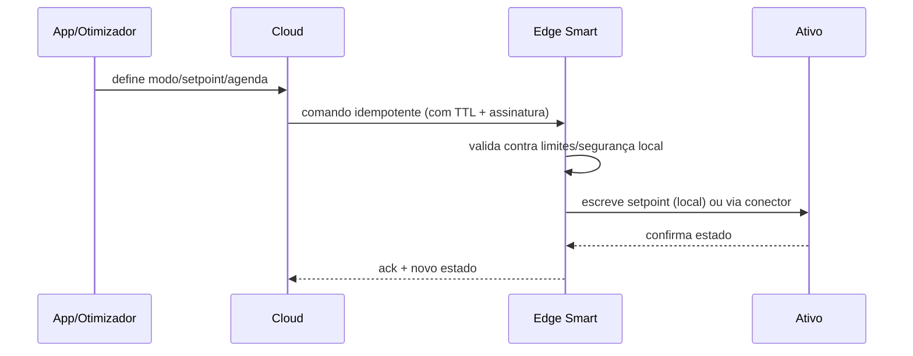
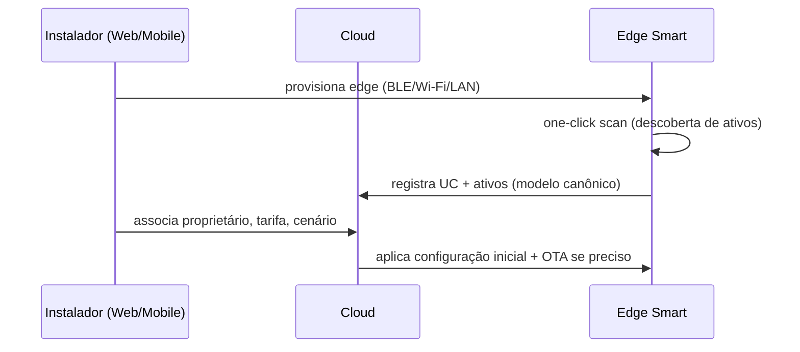

# 03 — Arquitetura de Sistema

> Arquitetura de referência do Smart: três camadas (**edge/hardware**, **nuvem**, **apps**) que cooperam para entregar monitoramento, controle determinístico e inteligência de mercado, de forma agnóstica de marca e com **topologia mista** — cada cenário usa só o que precisa.

---

## 1. Visão de contexto

Há **dois caminhos** até os ativos (herdando o conceito do white paper das fontes): **local** (edge ↔ ativos) e **cloud-to-cloud** (nuvem Smart ↔ nuvem do fabricante). A escolha por ativo é resolvida na [camada de integração](05-integracao-e-conectividade.md).

---

## 2. Camadas e responsabilidades

```mermaid
flowchart LR
  subgraph EDGE[Camada Edge - Hardware Smart]
    dal[Device Abstraction Layer local]
    ctrl[Malha de controle deterministica]
    opt_l[Otimizador local + scheduler]
    saf[Fail-safe / proteção local]
    saf2[Store-and-forward telemetria]
  end
  subgraph CLOUD[Camada Nuvem Smart]
    ing[Ingestão + Time-series]
    opt_c[Otimização + Forecast]
    tar[Serviço de Tarifa/Preço]
    vpp[VPP / Agregação]
    bill[Billing / Rateio GD]
    iam[IAM / Multi-tenant]
    api[API pública]
    conn[Conectores cloud-to-cloud]
  end
  subgraph APPS[Camada Apps]
    mob[Mobile - morador]
    web[Web Pro - instalador/agregador]
    gd[Portal GD]
  end
  EDGE <-->|MQTT/Sparkplug + comandos| CLOUD
  CLOUD <--> APPS
```

| Camada | Responsabilidades | Roda mesmo sem internet? |
|---|---|---|
| **Edge (hardware)** | Descoberta/leitura/escrita local de ativos; controle crítico (autoconsumo, backup, zero-export, peak shaving); execução de agendas; fail-safe; buffer de telemetria | **Sim** `[HW]` |
| **Nuvem** | Otimização pesada e forecast; tarifa/preço; agregação/VPP; billing/rateio; multi-tenant/IAM; API; conectores cloud-to-cloud; relatórios/diagnóstico | Não (mas o edge segue local) |
| **Apps** | Experiência por persona; configuração; visualização; automações; comissionamento | Parcial (cache) |

A definição de **qual função roda em qual camada** está catalogada em [10 — Modos de Operação](10-modos-de-operacao-e-features.md).

---

## 3. Topologias de implantação (mistas)

O produto suporta três topologias, combináveis por UC conforme o cenário ([11](11-matriz-de-cenarios.md)):

| Topologia | Quando | Caminho de dados/controle | Camada |
|---|---|---|---|
| **Só-nuvem (sem hardware Smart)** | N0–N1 simples; ativo já tem nuvem com API | App ↔ Smart Cloud ↔ nuvem do fabricante ↔ ativo | `[SW]` |
| **Edge + nuvem (recomendada)** | N2–N4; precisa de controle local e cargas multimarca | App ↔ Cloud ↔ **Gateway/Controller** ↔ ativos (local) | `[SW+HW]` |
| **Edge autônomo (offline-capaz)** | N2–N5 com requisito de operação sem internet | **Gateway/Controller** ↔ ativos; nuvem sincroniza quando volta | `[HW]` |

---

## 4. Fluxos principais

### 4.1 Telemetria (ativo → nuvem)

### 4.2 Controle / despacho (nuvem → ativo)

> **Princípio:** a nuvem **propõe**, o edge **dispõe** dentro de limites seguros. Se a nuvem cair, o edge segue executando a última agenda válida (`[HW]`).

### 4.3 Comissionamento

---

## 5. Requisitos não-funcionais (NFRs) `[PREMISSA]`

| NFR | Alvo |
|---|---|
| Latência de malha de controle local (edge) | < 1–2 s para ações críticas; sub-ciclo p/ proteções delegadas ao inversor |
| Latência comando nuvem→edge | < 5 s em rede normal |
| Frequência de telemetria | 1–10 s local; 1–5 min agregada p/ nuvem (configurável) |
| Disponibilidade nuvem | 99,9% |
| Operação offline do edge | Indefinida (modos `[HW]` seguem sem nuvem) |
| Escala | 10²–10⁶ UCs / 10⁷ pontos de telemetria por dia `[PREMISSA]` |
| Segurança de comando | Idempotência + TTL + assinatura + validação local de limites |

---

## 6. Arquitetura de segurança

- **Identidade de dispositivo:** cada hardware com **secure element/TPM**, certificado X.509 único, **secure boot** e firmware assinado (ver [06](06-especificacao-hardware.md)/[07](07-especificacao-firmware-edge.md)).
- **Canal edge↔nuvem:** **mTLS**; MQTT sobre TLS; tópicos isolados por tenant/UC.
- **Zero-trust:** nenhum componente confia implicitamente; autorização por papel (RBAC) e por escopo de UC.
- **Multi-tenant:** isolamento lógico por organização/UC; herda a hierarquia até 5 níveis do SEMS (distribuidor → instalador → técnico/marketer → proprietário) e adiciona agregador e gestor de GD (ver [08](08-plataforma-cloud-e-apis.md)).
- **Comandos:** assinados, idempotentes, com **validação local de segurança** no edge (um setpoint inseguro é recusado pelo hardware).
- **Privacidade/LGPD:** dados pessoais e de consumo tratados conforme LGPD `[VERIFICAR requisitos de retenção/consentimento]`.

---

## 7. Padrão de comunicação edge ↔ nuvem

- **Telemetria:** **MQTT** (preferencialmente **Sparkplug B** para descoberta de métricas e estado de nascimento/morte de dispositivos), com **store-and-forward** no edge.
- **Comando/config:** canal de comando MQTT (QoS 1+) ou gRPC sobre mTLS, sempre **idempotente**.
- **OTA:** pacote assinado, atualização **A/B** com rollback (ver [07](07-especificacao-firmware-edge.md)).

Detalhes de protocolos **a sul do edge** (até os ativos) em [05 — Integração](05-integracao-e-conectividade.md). Modelo de dados trafegado em [04 — Domínio e Dados](04-modelo-de-dominio-e-dados.md).
