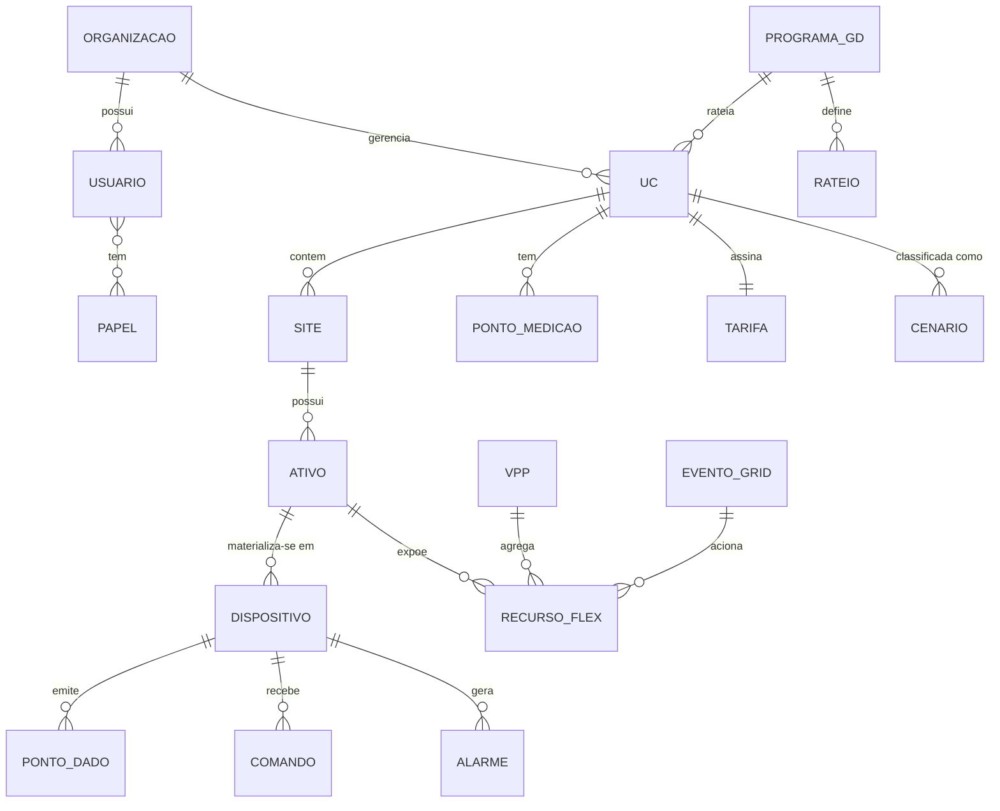
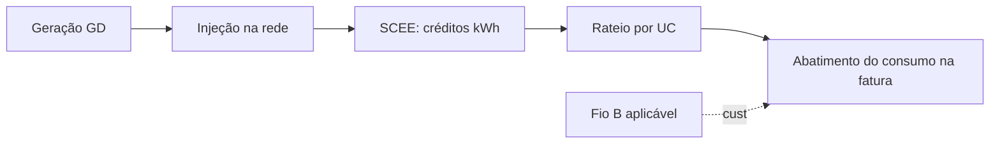

# 04 — Modelo de Domínio e Dados

> Modelo de domínio e **modelo canônico de dados** do Smart — a "língua comum" agnóstica de marca para a qual todos os ativos são traduzidos pela [camada de integração](05-integracao-e-conectividade.md). Aqui ficam as entidades, a telemetria padronizada por tipo de ativo, e o modelo de tarifa/crédito que alimenta a [otimização](08-plataforma-cloud-e-apis.md).

---

## 1. Entidades e relações

| Entidade | Descrição |
|---|---|
| **Organização / Tenant** | Distribuidor, instalador, agregador ou gestor de GD; hierarquia até 5 níveis |
| **Usuário / Papel** | Pessoa + RBAC (proprietário, técnico, instalador, agregador, gestor GD, admin) |
| **UC (Unidade Consumidora)** | Ponto de conexão faturável com a distribuidora; chave do mundo regulatório |
| **Site / Instalação** | Local físico (pode ter 1..N ativos); normalmente 1:1 com UC, mas multi-site existe (autoconsumo remoto) |
| **Ativo de energia** | Conceito lógico (inversor PV, bateria/ESS, EV charger, bomba, carga, medidor) |
| **Dispositivo** | Instância física de um ativo, de uma marca/modelo, com endereço/conector |
| **Ponto de dado** | Métrica padronizada emitida por um dispositivo (ver §2) |
| **Recurso de flexibilidade** | Capacidade despachável de um ativo (carregar/descarregar, modular, ligar/desligar) |
| **Tarifa** | Estrutura de preço/crédito vigente da UC (ver §3) |
| **Cenário** | Classificação arranjo×nível (ver [11](11-matriz-de-cenarios.md)) |
| **Programa de GD / Rateio** | Geração compartilhada e regras de partilha de créditos entre UCs |
| **VPP / Evento de grid service** | Agregação e acionamento de flexibilidade |
| **Comando / Alarme** | Ação de controle e ocorrência |

---

## 2. Modelo canônico de telemetria (por tipo de ativo)

Todos os drivers/conectores traduzem leituras nativas para estes **pontos de dado padronizados** (nomes/unidades/sinal fixos). Convenção de sinal: **+ = importando/consumindo/carregando**, **− = exportando/gerando/descarregando** (do ponto de vista da UC).

### Medidor de conexão (grid meter)
| Ponto | Unidade | Notas |
|---|---|---|
| `grid.power.active` | W | +importa / −exporta |
| `grid.power.reactive` | var | controle de reativo |
| `grid.energy.import` / `grid.energy.export` | Wh | acumulados (bidirecional) |
| `grid.voltage.LN[ ]` / `grid.frequency` | V / Hz | qualidade |

### Inversor PV / híbrido
| Ponto | Unidade | Notas |
|---|---|---|
| `pv.power` | W | geração instantânea |
| `pv.energy.today` / `pv.energy.total` | Wh | produção |
| `pv.mppt[n].voltage/current/power` | V/A/W | por string (diagnóstico IV) |
| `inv.status` / `inv.temp` | enum / °C | estado/temperatura |
| `inv.limit.export` (setpoint) | W ou % | zero-export / curtailment |

### Bateria / ESS (PCS + BMS)
| Ponto | Unidade | Notas |
|---|---|---|
| `bat.soc` / `bat.soh` | % | carga / saúde |
| `bat.power` | W | +carrega / −descarrega |
| `bat.energy.charged/discharged` | Wh | acumulados |
| `bat.temp` / `bat.cell.vmin/vmax` | °C / V | consistência (ver diagnóstico) |
| `bat.mode` / `bat.limit.power` (setpoint) | enum / W | modo e limite |

### EV charger
| Ponto | Unidade | Notas |
|---|---|---|
| `ev.state` | enum | desconectado/conectado/carregando/pausado |
| `ev.power` / `ev.energy.session` | W / Wh | sessão atual |
| `ev.current.offered` (setpoint) | A | modulação V1G |
| `ev.soc` (se disponível via veículo) | % | para smart charging |

### Bomba de calor (SG-Ready / heat pump)
| Ponto | Unidade | Notas |
|---|---|---|
| `hp.state` / `hp.power` | enum / W | operação |
| `hp.sgready.mode` (setpoint) | enum | estados SG-Ready (1–4) |
| `hp.temp.setpoint` | °C | conforto |

### Carga genérica (smart plug / relé)
| Ponto | Unidade | Notas |
|---|---|---|
| `load.power` / `load.energy` | W / Wh | medição |
| `load.switch` (setpoint) | bool | liga/desliga |
| `load.priority` | int | ordem de corte/uso |

> Pontos derivados (autoconsumo, autossuficiência, fluxo casa) são **calculados** a partir dos canônicos, no edge e/ou na nuvem.

---

## 3. Modelo de tarifa, crédito e preço

A entidade **Tarifa** é polimórfica para cobrir os [arranjos brasileiros](02-contexto-regulatorio-mercado-br.md):

| Tipo | Campos principais | Arranjo |
|---|---|---|
| **Fixa / convencional** | `price.import`, `price.export` (R$/kWh) | Cativo |
| **Tarifa Branca (ToU)** | postos `ponta/intermediario/fora_ponta` com janelas horárias + preços | Cativo |
| **Bandeiras** | adicional dinâmico `verde/amarela/vermelha1/vermelha2` (R$/kWh) | Cativo |
| **Dinâmica / mercado** | série temporal de preço (R$/MWh, PLD/contrato) + encargos | Mercado livre |
| **Demanda** (quando aplicável) | `demand.contracted`, `demand.price` | C&I em BT `[VERIFICAR]` |

### Crédito de GD (SCEE)
- `credit.balance[UC]` (kWh) com **validade** (vencimento por safra mensal).
- `feedin.fioB.fraction` (rampa anual de cobrança do Fio B — ver [02](02-contexto-regulatorio-mercado-br.md)).
- **Rateio:** `PROGRAMA_GD.rateio[UC] = %` (geração compartilhada/EMUC).
- O otimizador usa esses campos para decidir **autoconsumir vs injetar vs armazenar**.

---

## 4. Identidade, unidades e qualidade de dados

- **Identificadores:** `tenant_id`, `uc_id`, `site_id`, `asset_id`, `device_id`, `point_id` (estáveis e globais).
- **Unidades SI** padronizadas (W, Wh, V, A, °C, Hz, R$); timestamps em **UTC** com timezone da UC anexada.
- **Qualidade:** cada amostra carrega `quality` (good/uncertain/bad) e `source` (edge-local / cloud-connector) — importante quando o mesmo ativo é lido por dois caminhos ([05](05-integracao-e-conectividade.md)).

---

## 5. Time-series e retenção `[PREMISSA]`

| Camada | Resolução | Retenção |
|---|---|---|
| Edge (buffer) | 1–10 s | horas–dias (store-and-forward) |
| Nuvem quente (TSDB) | 1 min | 13 meses |
| Nuvem fria (downsample) | 15 min / 1 h | 5–10 anos |
| Eventos/alarmes/comandos | por evento | 5 anos |

O modelo canônico é o contrato que liga [integração](05-integracao-e-conectividade.md), [edge](07-especificacao-firmware-edge.md), [nuvem](08-plataforma-cloud-e-apis.md) e [apps](09-apps-web-mobile-e-ux.md).
