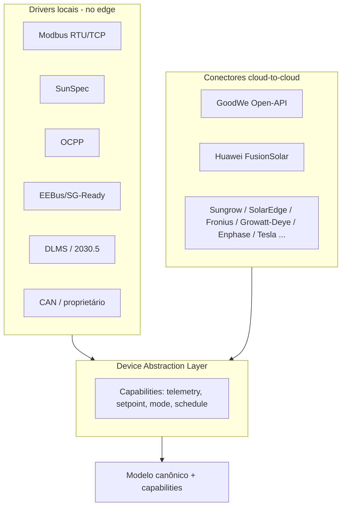
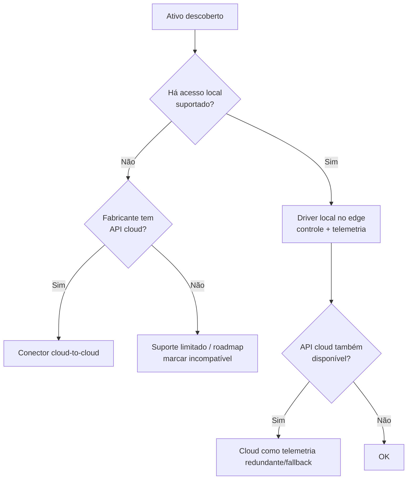

# 05 — Integração e Conectividade (marca-agnóstica)

> Como o Smart fala com **qualquer ativo, de qualquer marca**, por **dois caminhos** (local no hardware e cloud-to-cloud) sob uma única abstração. Esta é a peça que torna o produto agnóstico e que materializa o conceito de integração do white paper das fontes (Modbus/SunSpec/Modbus-TCP local + Open-API na nuvem).

---

## 1. Device Abstraction Layer (DAL)

Toda integração é traduzida para o **modelo canônico** ([04](04-modelo-de-dominio-e-dados.md)). A DAL expõe cada dispositivo por **capabilities**, não por marca:

**Contrato de capability (interno):**
| Capability | Operações | Exemplo |
|---|---|---|
| `telemetry` | read | `pv.power`, `bat.soc` |
| `setpoint` | read/write | `inv.limit.export`, `ev.current.offered` |
| `mode` | read/write | `bat.mode = self_consumption` |
| `schedule` | read/write | agenda de carga/descarga |
| `meta` | read | marca, modelo, firmware, limites |

Cada driver/conector declara **quais capabilities suporta** e **por qual caminho** (local/cloud). Quando os dois existem, a DAL prioriza o **local** para controle (latência/offline) e usa a **nuvem** como fallback/telemetria — ver §4.

---

## 2. Protocolos locais (executados no hardware Smart `[HW]`/`[SW+HW]`)

| Protocolo | Uso | Classe de ativo | Observações |
|---|---|---|---|
| **Modbus RTU (RS485)** | leitura/escrita registradores | inversor, bateria, medidor | mapas específicos por fabricante; precisa de biblioteca de perfis |
| **Modbus TCP (LAN)** | idem sobre Ethernet | inversor, medidor, PCS | |
| **SunSpec Modbus** | modelos padronizados | inversor (101/102/103), storage (124), medidor (201–204), bateria (802+) | **preferencial** quando o equipamento suporta — reduz custo de integração |
| **OCPP 1.6 / 2.0.1** | controle de carregador de VE | EV charger | *smart charging profiles*; 2.0.1 traz melhor gestão de carga |
| **EEBus (SPINE)** / **SG-Ready** | gestão de bomba de calor | heat pump | SG-Ready = 4 estados via 2 entradas digitais (DI/relé); EEBus = mais rico |
| **DLMS/COSEM** | leitura de medidor | smart meter | medição regulatória/bidirecional |
| **IEEE 2030.5 (CSIP)** | controle de DER padronizado | inversor/DER | relevante para grid services/curtailment ordenado |
| **IEC 61850** | DER/subestação de maior porte | mini/grandes DER | opcional, N5/C&I |
| **Matter (Energy)** | dispositivos de casa inteligente | cargas, tomadas | ecossistema emergente |
| **CAN** | BMS/PCS proprietários | bateria | conforme fabricante |

> O **Smart Gateway** ([06](06-especificacao-hardware.md)) traz **RS485 ×N, Ethernet, Wi-Fi/BT, DI/DO (sinal)/AI, CAN** e **4G opcional** — cobrindo a tabela acima fisicamente; a medição vem do **Smart Meter** (dedicado ou integrado).

### Smart plugs / cargas simples
Compatibilidade com **smart plugs** (ex.: padrão Shelly, como nas fontes, e equivalentes via Matter/Wi-Fi/Zigbee) para medir e chavear cargas comuns — capability `load.power` + `load.switch`.

---

## 3. Conectores cloud-to-cloud (executados na nuvem Smart `[SW]`)

Quando **não há acesso local** (ou como redundância), o Smart integra a **nuvem do fabricante** via API. Capacidades variam muito por fabricante — a tabela abaixo é o ponto de partida e **todos os detalhes de campos/limites são `[VERIFICAR]`** com a documentação oficial e contratos de parceria.

**Prioridade de conectores (decisão do usuário):** **GoodWe · Deye · Sungrow · Growatt · Huawei · Solis** — maior presença em BT no Brasil. Os demais entram em fase posterior.

| Prioridade | Fabricante / API | Leitura (telemetria) | Controle (escrita) | Observações |
|---|---|---|---|---|
| 1 | **GoodWe — SEMS Open-API** | Sim (raw + processed) | **Sim (batch control)** — citado no white paper | Caminho preferencial p/ ativos GoodWe sem edge; campos exatos `[VERIFICAR]` |
| 2 | **Deye — Solarman (OSS/OpenAPI)** | Sim | Parcial | muito comum no BR; `[VERIFICAR]` |
| 3 | **Sungrow — iSolarCloud OpenAPI** | Sim | Limitado | `[VERIFICAR]` |
| 4 | **Growatt — OpenAPI / Solarman** | Sim | Parcial | comum no BR; mapas semi-públicos; `[VERIFICAR]` |
| 5 | **Huawei — FusionSolar (Northbound)** | Sim | Limitado | controle restrito a parceiros; `[VERIFICAR]` |
| 6 | **Solis — SolisCloud API / Solarman** | Sim | Limitado | `[VERIFICAR]` |
| — | SolarEdge — Monitoring API | Sim | **Não (só leitura)** | controle exige integração local |
| — | Fronius — Solar API | Sim (LAN + Solar.web) | Limitado | API local read-only |
| — | Enphase — Enlighten API | Sim | Limitado | microinversores |
| — | Tesla — Fleet/Powerwall API | Sim | Parcial | Powerwall |

> **GoodWe Open-API tem 3 tipos** (referência do produto): **(1) OpenAPI** — dados de negócio processados pelo SEMS, HTTPS, limite ~3600 req/h; **(2) Real-time Data** — dados *raw* dos dispositivos (raw/Kafka), aberto a terceiros, **sem controle remoto**; **(3) Batch Remote Control** — controle remoto via **Kafka**, usado junto à Real-time Data para suportar **VPP/microgrid**. O conector GoodWe do [`energy-connectors`](../../repos/energy-connectors/) deve cobrir os três — doc oficial: **https://openapi.goodwe.com/#/api/doc-10a71afe72c271**. `[VERIFICAR contra doc oficial / parceria]`

> Os detalhes reais de cada API (campos, limites de controle) são levantados no **projeto de integração** (templates por fabricante e matriz de compatibilidade) — ver [`docs/smart/integracao/`](integracao/00-modelo-de-abstracao.md). Todos os campos marcados `[VERIFICAR]` até a ingestão dos docs oficiais.

> **Regra de produto:** controle determinístico crítico **deve** preferir o caminho **local**; conectores cloud servem para **monitoramento universal** e para **controle onde o fabricante o permite**. Limitações conhecidas devem ser explicitadas ao usuário (ex.: "este inversor só permite monitoramento via nuvem").

---

## 4. Estratégia local ↔ cloud (resolução por ativo)

- **Controle:** local > cloud (latência, offline, determinismo).
- **Telemetria:** preferir local; usar cloud para preencher lacunas e validar.
- **Conflito de fonte:** o campo `source`/`quality` ([04](04-modelo-de-dominio-e-dados.md)) define prioridade; nunca dois caminhos escrevem setpoint simultâneo (lock por ativo no edge).

---

## 5. Matriz de suporte (capability × caminho) — modelo

Para cada modelo homologado, manter uma **ficha de compatibilidade**:

| Campo | Exemplo |
|---|---|
| Marca/Modelo/Firmware mín. | GoodWe ET 10K, fw ≥ x |
| Caminho | local (Modbus TCP / SunSpec) e/ou cloud (Open-API) |
| Capabilities | telemetry ✓, setpoint(export limit) ✓, mode(bat) ✓, schedule ✓ |
| Limites/observações | ex.: zero-export passo mínimo, latência |
| Status de certificação Smart | testado/validado/beta |

A lista de modelos suportados é um **ativo vivo** do produto e um diferencial competitivo (cobertura multimarca — KPI em [01](01-visao-e-prd.md)).

---

## 6. Processo de certificação de compatibilidade

1. **Aquisição do mapa/integração** (datasheet Modbus, SunSpec, doc da API cloud, ou parceria).
2. **Implementação do driver/conector** contra o modelo canônico.
3. **Banco de ensaios** (hardware-in-the-loop / equipamento real): leitura, escrita, limites, falhas, reconexão.
4. **Validação de segurança** (recusa de setpoints inseguros, respeito a anti-ilhamento — o Smart **não** desabilita proteções do inversor; ver [02](02-contexto-regulatorio-mercado-br.md)/[07](07-especificacao-firmware-edge.md)).
5. **Publicação** na matriz com status e firmware mínimo.

---

## 7. Classificação por camada (resumo)

| Caminho de integração | Camada |
|---|---|
| Drivers locais (Modbus/SunSpec/OCPP/EEBus/DLMS/2030.5/CAN) | `[HW]` / `[SW+HW]` |
| Conectores cloud-to-cloud (GoodWe Open-API e equivalentes) | `[SW]` |
| Resolução/decisão de caminho e modelo canônico | `[SW+HW]` (lógica replicada edge+nuvem) |

> Hardware que executa os drivers locais: [06](06-especificacao-hardware.md). Lógica de controle/otimização que consome estas capabilities: [07](07-especificacao-firmware-edge.md) (edge) e [08](08-plataforma-cloud-e-apis.md) (nuvem).
