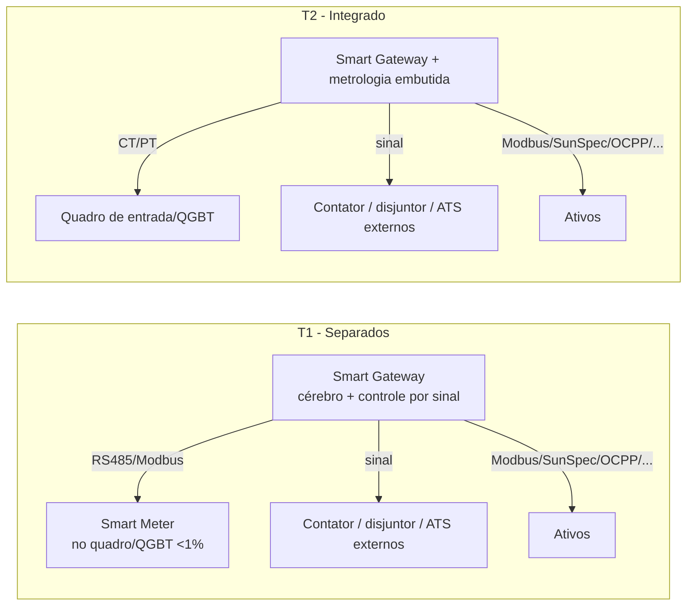
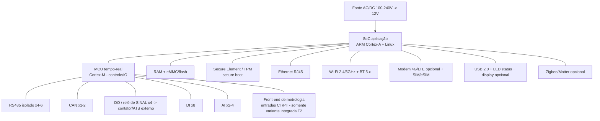

# 06 — Especificação de Hardware (família Smart)

> Especificação, em nível **OEM/ODM** (montável com SoC/módulos de mercado, sem PCB do zero), do hardware proprietário do Smart. A família tem **dois elementos** — o **Smart Gateway** (o HEMS/cérebro, que controla por **sinal**) e o **Smart Meter** (medição *commodity*) — que podem ser **separados** ou **integrados no mesmo aparelho**. A comunicação física habilita os [drivers locais](05-integracao-e-conectividade.md); o software embarcado está em [07](07-especificacao-firmware-edge.md).

> Faixas/escolhas de componente marcadas `[PREMISSA]`; certificações marcadas `[VERIFICAR]`.

---

## 1. Princípios de hardware (decisões travadas)

1. **Gateway = controller (um aparelho só).** Não há SKU "Controller" separado: o **Smart Gateway** é o cérebro do HEMS e também o controlador.
2. **Controle por SINAL, não por potência.** O Gateway aciona cargas/transferência via **relé/IO em nível de sinal** (contato seco / nível lógico). **Quem chaveia potência é externo**: contator, disjuntor motorizado ou **ATS** de terceiros. O Gateway nunca conduz a corrente de carga.
3. **Medição é commodity.** O **Smart Meter** pode ser proprietário ou OEM/ODM; requisito essencial é **exatidão < 1% de desvio**, instalado no **quadro de entrada ou no QGBT**.
4. **Duas topologias** (a escolha é por projeto/UC):
   - **T1 — Separados:** Smart Gateway + Smart Meter (medidor no quadro; Gateway o lê por RS485/Modbus).
   - **T2 — Integrado:** medição **embutida** no mesmo hardware do Gateway (metrologia interna + gateway/controller num só box).

---

## 2. Smart Gateway (o HEMS) — diagrama de blocos

### Especificação (alvo) `[PREMISSA]`

| Item | Smart Gateway |
|---|---|
| **SoC aplicação** | ARM Cortex-A + Linux — candidatos: **NXP i.MX8M**, **TI Sitara AM62x**, **ST STM32MP2** (Cortex-A35 + Cortex-M33 de *safety* no mesmo chip), RK3568. **Dois domínios** (Cortex-A aplicação + Cortex-M tempo-real/safety) é o padrão para o laço crítico de zero-export |
| **Co-processador** | MCU Cortex-M para I/O e controle determinístico |
| **Memória** | ≥ 1 GB RAM, ≥ 8–16 GB eMMC `[PREMISSA]` |
| **Segurança** | Secure Element/TPM, secure boot, X.509 por dispositivo |
| **Comunicação ativos** | RS485 isolado ×4–6, CAN ×1–2, Modbus RTU/TCP, SunSpec |
| **Rede (WAN/LAN)** | Ethernet, Wi-Fi 2.4/5 GHz, BT 5.x, **4G/LTE opcional** (sites sem internet fixa) — módulo candidato **Quectel EG915U-LA** (LTE Cat 1, variante LatAm, com homologação ANATEL) `[VERIFICAR status no painel ANATEL]` |
| **Casa inteligente** | Zigbee/Matter (opcional), smart plugs Wi-Fi |
| **Controle (saídas)** | **DO / relé de SINAL ×4** (contato seco) → comanda **contator / disjuntor motorizado / ATS externos**; **não** chaveia potência |
| **Entradas** | DI ×8, AI ×2–4 |
| **Metrologia** | **somente na variante integrada (T2)**: entradas **CT/PT**, exatidão **< 1%** |
| **Capacidade** | múltiplos inversores/baterias, EV, bomba SG-Ready, dezenas de smart plugs (supera limites fixos do EzManager) `[PREMISSA]` |
| **UI** | LEDs de status, USB 2.0, display opcional |
| **Alimentação** | AC 100–240 V 50/60 Hz → 12 V DC; consumo ≤ ~7–10 W |
| **Mecânica** | DIN / parede / mesa |
| **Ambiental** | −25…+60 °C, 0–95% UR sem condensação, IP20 (quadro/interno) |

> O **backup/ilhamento** é coordenado pelo Gateway **comandando** a transferência (sinal → ATS/contator externo) e dialogando com o inversor híbrido; o Gateway **respeita o anti-ilhamento do inversor** ([02](02-contexto-regulatorio-mercado-br.md)/[07](07-especificacao-firmware-edge.md)).

---

## 3. Smart Meter (medição) — *commodity*

| Item | Smart Meter |
|---|---|
| **Função** | medir energia/potência/tensão/corrente (bidirecional) no ponto de conexão |
| **Local** | **quadro de entrada** ou **QGBT** |
| **Exatidão (medição EMS)** | **< 1% de desvio** — alvo **classe 1 (IEC 62053-21/22)**, recomendado **0,5S** de folga (≈ INMETRO classe C/B) |
| **Fornecimento** | **commodity** — proprietário **ou** OEM/ODM de mercado |
| **Medição** | monofásico / bifásico / trifásico conforme a UC; entradas CT |
| **Comunicação** | **RS485 (Modbus-RTU)** para o Gateway; opções Modbus-TCP/M-Bus `[PREMISSA]` |
| **Observação** | quando a topologia é **T2 (integrado)**, esta função vive **dentro** do Gateway |

> Para níveis que exigem **peak shaving / zero-export / grid services** ([10](10-modos-de-operacao-e-features.md)), recomenda-se **Smart Meter dedicado** (T1) ou variante **integrada** (T2) — não depender só do medidor interno do inversor.

> **Candidatos OEM de Smart Meter** (*commodity*, ~R$100 CIF, Modbus-RTU, adequados ao split-phase BR): **Eastron SDM630** (trifásico, classe **0,5S**, bidirecional, versão CT) e **SDM120** (monofásico, classe 1); **Acrel ADL200** (mono) e **ADL400** (trifásico, classe 0,5, suporta split-phase). Atendem IEC 62053-21/22. Com a **Portaria INMETRO 657/2025** (Declaração de Conformidade), usar medidor OEM certificado fica mais simples. `[VERIFICAR cobertura 127/254V por região e DC INMETRO]`

> **Medição EMS vs faturamento.** Por padrão o Smart Meter é um **medidor de EMS** (controle: peak shaving, zero-export, autoconsumo); o **medidor de faturamento oficial** continua sendo o da **distribuidora** (GD bidirecional, **PRODIST Módulo 5** / REN 956/2021) ou o do **SMF** (mercado livre). Se o Smart Meter for usado para **faturamento/liquidação**, precisa de **modelo aprovado pelo INMETRO** (RTM **Portaria 587/2012** — classes D 0,2% / C 0,5% / B 1,0% / A 2,0%) e atender **PRODIST Módulo 5** (bidirecional; diferenciar energia consumida e injetada) e os requisitos de **SMF** (memória de massa em intervalos de 5–60 min por ≥ 32 dias, relógio sincronizável a GMT-3, conformidade ABNT/IEC). `[VERIFICAR classe exigida por uso]`

---

## 4. Variantes / SKUs

| Variante | Descrição | Quando |
|---|---|---|
| **Smart Gateway (base)** | cérebro + comunicação + controle por sinal; sem metrologia própria | T1, lê Smart Meter externo ou medidor do inversor |
| **Smart Gateway + metrologia (integrado)** | acima + entradas CT/PT internas (< 1%) | T2, quando se quer um box único |
| **Smart Meter** | medidor *commodity* < 1% no quadro | T1, par do Gateway base |

> Não há mais "Smart Controller": as capacidades antes atribuídas a ele (medição, transferência, 4G, mais I/O) viram **opções do Gateway** (metrologia integrada, 4G) e **acionamento por sinal** de equipamentos de potência externos.

---

## 5. BOM-classe indicativa `[PREMISSA]`

| Bloco | Componente-classe |
|---|---|
| Computação | módulo SoM Cortex-A (i.MX8M Mini / RK3568) + MCU STM32/equivalente |
| Memória | LPDDR4 1–2 GB + eMMC 8–16 GB |
| Segurança | SE/TPM (classe ATECC/OPTIGA) |
| Comunicação | transceptores RS485 isolados, PHY Ethernet, módulo Wi-Fi/BT certificável, módulo 4G opcional |
| Metrologia (T2) | front-end de medição (AFE) + entradas CT |
| Saídas de controle | relés de **sinal** / saídas a contato seco (sem condução de potência) |
| Potência (alimentação) | fonte AC/DC, proteção/surto |
| Mecânica | gabinete DIN/parede, conectores plugáveis |

> Priorizar **rádios pré-certificados** (reduz custo/tempo de homologação ANATEL). `[VERIFICAR]`

---

## 6. Certificações para o Brasil

| Domínio | Requisito | Status |
|---|---|---|
| **Radiofrequência** | **Homologação ANATEL** obrigatória (Wi-Fi/BT/4G) | `[VERIFICAR]` — usar módulos pré-certificados |
| **Segurança elétrica** | conformidade ABNT/NBR aplicável a eletroeletrônico; instalação NBR 5410 | `[VERIFICAR]` |
| **Metrologia (Smart Meter)** | exatidão **< 1%**; eventual aprovação metrológica (INMETRO/portaria de medidores) conforme uso faturável | `[VERIFICAR classe/uso]` |
| **INMETRO inversores (140/2022 + 515/2023)** | aplica-se ao **inversor**, **não** ao Gateway/Meter Smart | ver [02](02-contexto-regulatorio-mercado-br.md) |
| **EMC** | ensaios de compatibilidade eletromagnética | `[VERIFICAR]` |

> O Gateway é um **controlador/gateway**; o Meter é um **medidor**. **Nenhum** substitui as proteções regulatórias do **inversor** (anti-ilhamento, limites) — requisito de firmware ([07](07-especificacao-firmware-edge.md)) e regulatório ([02](02-contexto-regulatorio-mercado-br.md)).

---

## 7. Interfaces de usuário no hardware

- **LEDs** de status (energia, nuvem, ativos, falha) — herdado do EzManager.
- **USB** para serviço/diagnóstico local; **display opcional**.
- **BLE/Wi-Fi AP** para provisionamento pelo app no comissionamento ([09](09-apps-web-mobile-e-ux.md)).

Próximo: o que roda dentro dele em [07 — Firmware/Edge](07-especificacao-firmware-edge.md).
