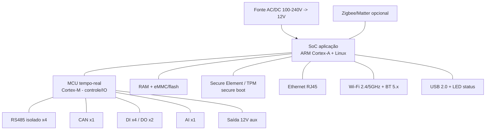
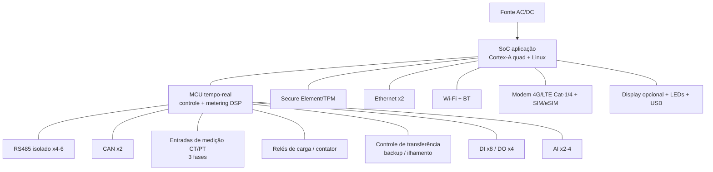

# 06 — Especificação de Hardware (família Smart)

> Especificação, em nível **OEM/ODM** (pronta para fabricar com módulos/SoC de mercado, sem PCB do zero), da **família de hardware proprietário** do Smart. Dois SKUs cobrem do retrofit simples ao controle completo com medição e backup. Toda a comunicação física habilita os [drivers locais](05-integracao-e-conectividade.md), e o software embarcado está em [07](07-especificacao-firmware-edge.md).

> Faixas e escolhas de componente marcadas `[PREMISSA]`; certificações marcadas `[VERIFICAR]` (dependem de homologação/ensaio).

---

## 1. Famílias e posicionamento

| SKU | Posição | Inspirado em | Cenários ([11](11-matriz-de-cenarios.md)) |
|---|---|---|---|
| **Smart Gateway** | Gateway de borda *plug & play* para **retrofit** | classe EzManager3000 (fonte) | N1–N4, foco residencial |
| **Smart Controller** | Controlador completo com **medição + relés + backup + 4G** | EMS de borda tipo gridX/Kiwigrid | N2–N5, grid services/VPP, GD |

Ambos rodam o **mesmo firmware base** ([07](07-especificacao-firmware-edge.md)) com módulos habilitados por capacidade de hardware.

---

## 2. Smart Gateway — diagrama de blocos

### Especificação (alvo) `[PREMISSA]`

| Item | Smart Gateway |
|---|---|
| **SoC aplicação** | ARM Cortex-A (classe i.MX8M / Rockchip RK3568), Linux | 
| **Co-processador** | MCU Cortex-M para I/O e controle determinístico |
| **Memória** | ≥ 1 GB RAM, ≥ 8 GB eMMC `[PREMISSA]` |
| **Segurança** | Secure Element/TPM, secure boot, X.509 por dispositivo |
| **Comunicação ativos** | RS485 isolado ×4, CAN ×1, Modbus RTU/TCP, SunSpec |
| **Rede** | Ethernet ×1, Wi-Fi 2.4/5 GHz, Bluetooth 5.x |
| **Casa inteligente** | Zigbee/Matter (opcional), smart plugs Wi-Fi |
| **I/O** | DI ×4, DO ×2, AI ×1, saída 12 V aux |
| **Capacidade de gestão** | múltiplos inversores/baterias, EV, bomba SG-Ready, dezenas de smart plugs (supera limites fixos do EzManager) `[PREMISSA]` |
| **UI** | LEDs de status, USB 2.0 (serviço) |
| **Alimentação** | AC 100–240 V 50/60 Hz → 12 V DC; consumo ≤ ~7–10 W |
| **Mecânica** | DIN / parede / mesa; classe ~100×86×71 mm |
| **Ambiental** | −25…+60 °C, 0–95% UR sem condensação, IP20 (interno/quadro) |

---

## 3. Smart Controller — diagrama de blocos

### Especificação (alvo) `[PREMISSA]`

| Item | Smart Controller (adicional ao Gateway) |
|---|---|
| **SoC aplicação** | Cortex-A quad-core, Linux (mais folga p/ otimização local) |
| **Medição integrada** | entradas **CT/PT trifásicas**, classe de exatidão de medição (alvo classe 1 / 0,5S) `[VERIFICAR]` — habilita peak shaving/zero-export sem medidor externo |
| **Relés / contator** | saídas de potência para **chaveamento de cargas** e comando de **contator de transferência (backup)** |
| **Backup / ilhamento** | interface de **transferência** (ATS) coordenada com inversor híbrido; respeita anti-ilhamento ([02](02-contexto-regulatorio-mercado-br.md)) |
| **Conectividade WAN** | + **4G/LTE** (Cat-1/Cat-4) com SIM/eSIM, para sites sem internet fixa |
| **Comunicação ativos** | RS485 ×4–6, CAN ×2 |
| **I/O** | DI ×8, DO ×4, AI ×2–4 |
| **UI** | display opcional, LEDs, USB |
| **Mecânica** | DIN (quadro), maior gabarito; IP20 (quadro) ou IP-superior em variante externa `[PREMISSA]` |

---

## 4. Comparativo de SKUs

| Recurso | Smart Gateway | Smart Controller |
|---|---|---|
| Retrofit *plug & play* | ✅ | ✅ |
| RS485 / CAN | 4 / 1 | 4–6 / 2 |
| Wi-Fi / BT / Ethernet | ✅ / ✅ / 1 | ✅ / ✅ / 2 |
| 4G/LTE | opcional | ✅ |
| Medição própria (CT) | ❌ (usa medidor do inversor/externo) | ✅ |
| Relés de carga / backup | DO de sinal | ✅ potência + transferência |
| Controle determinístico offline | ✅ | ✅ (mais robusto) |
| Grid services / VPP (N5) | limitado | ✅ recomendado |
| Público | residencial retrofit | residencial+ / GD / agregador |

---

## 5. BOM-classe indicativa `[PREMISSA]`

| Bloco | Componente-classe |
|---|---|
| Computação | módulo SoM Cortex-A (i.MX8M Mini / RK3568) + MCU STM32/equivalente |
| Memória | LPDDR4 1–2 GB + eMMC 8–16 GB |
| Segurança | SE/TPM (ex.: classe ATECC/OPTIGA) |
| Comunicação | transceptores RS485 isolados, PHY Ethernet, módulo Wi-Fi/BT certificável, módulo 4G (Controller) |
| Medição (Controller) | front-end de metrologia (AFE) + entradas CT |
| Potência | fonte AC/DC, relés/contator (Controller), proteção/surto |
| Mecânica | gabinete DIN/parede, conectores plugáveis |

> A escolha final de SoC/módulos deve priorizar **componentes já homologáveis** (rádios com certificação prévia reduzem custo/tempo de ANATEL). `[VERIFICAR]`

---

## 6. Certificações para o Brasil

| Domínio | Requisito | Status |
|---|---|---|
| **Radiofrequência** | **Homologação ANATEL** obrigatória (Wi-Fi/BT/4G) | `[VERIFICAR]` — preferir módulos pré-certificados |
| **Segurança elétrica** | conformidade ABNT/NBR aplicável a eletroeletrônico; instalação NBR 5410 | `[VERIFICAR]` |
| **Inversor (se o produto atuar na interface de geração)** | NBR 16149/16150, IEC 62116 são do **inversor**, não do gateway — o Smart **não substitui** a proteção do inversor | ver [02](02-contexto-regulatorio-mercado-br.md) |
| **EV** | se houver hardware de carga, NBR IEC 61851/62196 | `[VERIFICAR]` |
| **EMC / segurança geral** | ensaios de compatibilidade eletromagnética | `[VERIFICAR]` |

> O hardware Smart é um **controlador/medidor/gateway**, não um inversor; portanto **não pode desabilitar** proteções regulatórias do inversor (anti-ilhamento, limites). Isso é requisito de firmware ([07](07-especificacao-firmware-edge.md)) e regulatório ([02](02-contexto-regulatorio-mercado-br.md)).

---

## 7. Interfaces de usuário no hardware

- **LEDs** de status (energia, nuvem, ativos, falha) — padrão herdado do EzManager (LED ×4).
- **USB** para serviço/diagnóstico local.
- **BLE/Wi-Fi AP** para provisionamento pelo app no comissionamento ([09](09-apps-web-mobile-e-ux.md)).
- **Display opcional** no Controller para leitura local sem app.

Próximo: o que roda dentro dele em [07 — Firmware/Edge](07-especificacao-firmware-edge.md).
