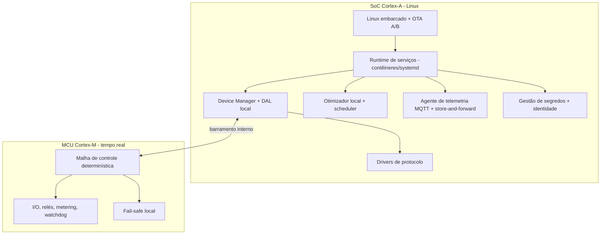
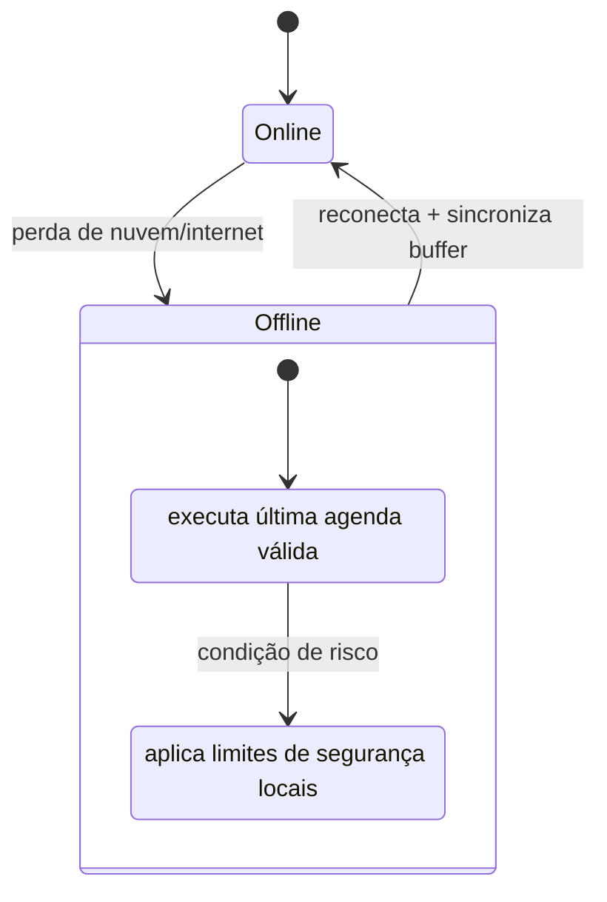

# 07 — Especificação de Firmware / Edge

> O software de borda do [hardware Smart](06-especificacao-hardware.md): o que roda **localmente**, garante **controle determinístico e offline**, executa os [modos de operação](10-modos-de-operacao-e-features.md) críticos e conversa com a [nuvem](08-plataforma-cloud-e-apis.md) por MQTT. É aqui que muitas funções "que só dariam para fazer pelo app" passam a rodar **no hardware** — o pedido central do produto.

---

## 1. Stack de software embarcado

- **SoC (Linux):** lógica rica — DAL, drivers, otimização local, telemetria, OTA, segurança.
- **MCU (tempo real):** controle determinístico, I/O, medição, **fail-safe** que opera **mesmo se o Linux travar**.

---

## 2. Módulos principais

| Módulo | Função | Camada |
|---|---|---|
| **Device Manager + DAL local** | descoberta (one-click scan), inventário, tradução p/ modelo canônico ([04](04-modelo-de-dominio-e-dados.md)) | `[HW]` |
| **Drivers de protocolo** | Modbus RTU/TCP, SunSpec, OCPP, EEBus/SG-Ready, DLMS/2030.5, CAN ([05](05-integracao-e-conectividade.md)) | `[HW]` |
| **Otimizador local + scheduler** | executa agendas e regras de despacho; fallback do otimizador de nuvem | `[HW]` |
| **Malha de controle (MCU)** | aplica setpoints com baixa latência; lê medição; aciona relés | `[HW]` |
| **Fail-safe / proteção local** | regras de segurança independentes da nuvem (limites, zero-export, ilhamento intencional) | `[HW]` |
| **Agente de telemetria** | publica MQTT/Sparkplug; **store-and-forward** quando offline | `[SW+HW]` |
| **OTA** | atualização A/B assinada com rollback | `[SW+HW]` |
| **Segurança** | secure boot, identidade X.509, segredos, mTLS | `[HW]` |

---

## 3. Modos de operação executados no edge

A lista completa e a classificação estão em [10](10-modos-de-operacao-e-features.md); aqui, o que **precisa** rodar no edge e **por quê**:

| Modo | Por que no edge | Etiqueta |
|---|---|---|
| **Autoconsumo (self-consumption)** | malha rápida PV↔carga↔bateria; não pode depender de nuvem | `[HW]` |
| **Backup / ilhamento intencional** | transição em falta de rede deve ser local e imediata | `[HW]` |
| **Zero-export / limite de injeção** | resposta rápida para não violar limite regulatório | `[HW]` |
| **Peak shaving / limite de demanda** | precisa medir e atuar em segundos | `[HW]` (com Smart Meter / Gateway integrado) |
| **Load shifting por tarifa (agenda)** | agenda baixada da nuvem, **executada** local | `[AMBOS]` |
| **EV smart charging (modulação)** | modular corrente conforme excedente PV em tempo real | `[SW+HW]` |
| **Despacho de grid service** | recebe sinal da nuvem/VPP, **executa** com garantias locais | `[SW+HW]` |
| **Controle de reativo / fator de potência** | malha rápida junto ao inversor | `[HW]` |

> **Regra de ouro:** a nuvem calcula o **plano** (forecast/otimização/preço); o edge **executa e protege**. Sem nuvem, o edge segue o último plano válido e as regras de segurança.

---

## 4. Comportamento offline (garantias)

- Modos `[HW]` continuam (autoconsumo, backup, zero-export, peak shaving, agendas já baixadas).
- Telemetria é **bufferizada** e reenviada na reconexão (store-and-forward).
- Comandos da nuvem têm **TTL**: expiram se ficarem velhos demais, evitando ações obsoletas.

---

## 5. Latência e determinismo `[PREMISSA]`

| Ação | Alvo |
|---|---|
| Leitura local de ativo | 1–10 s (configurável) |
| Aplicação de setpoint local | < 1–2 s |
| Proteção/fail-safe (MCU) | dezenas de ms |
| Transição de backup | conforme inversor híbrido (ms a poucos s) |

Proteções **regulatórias de tempo crítico** (anti-ilhamento, desconexão) permanecem **no inversor** — o edge as **respeita**, não as substitui ([02](02-contexto-regulatorio-mercado-br.md)/[06](06-especificacao-hardware.md)).

---

## 6. OTA, watchdog e recuperação

- **OTA A/B:** dois slots; aplica em slot inativo, valida, troca; **rollback** automático se o boot falhar.
- **Assinatura:** todo firmware/pacote é assinado; o **secure boot** recusa imagem não assinada.
- **Watchdog:** o MCU monitora o SoC; em travamento, mantém fail-safe e reinicia o Linux.
- **Atualização de drivers/perfis** de equipamento sem trocar o firmware base (pacotes de perfil — útil para ampliar a [matriz de compatibilidade](05-integracao-e-conectividade.md)).

---

## 7. Segurança do edge

| Item | Mecanismo |
|---|---|
| Integridade de boot | secure boot encadeado a SE/TPM |
| Identidade | certificado X.509 único por dispositivo |
| Canal | mTLS p/ nuvem; MQTT sobre TLS |
| Segredos | armazenados em SE/TPM, nunca em claro |
| Comandos | assinados, idempotentes, validados contra limites locais |
| Atualização | assinada + rollback |
| Superfície | serviços mínimos; USB/serial de serviço autenticado |

> O edge **valida localmente** todo comando: um setpoint que violaria limite de segurança ou regulatório é **recusado pelo hardware**, independentemente da origem. Liga-se à [arquitetura de segurança](03-arquitetura-de-sistema.md) e ao [catálogo de modos](10-modos-de-operacao-e-features.md).
