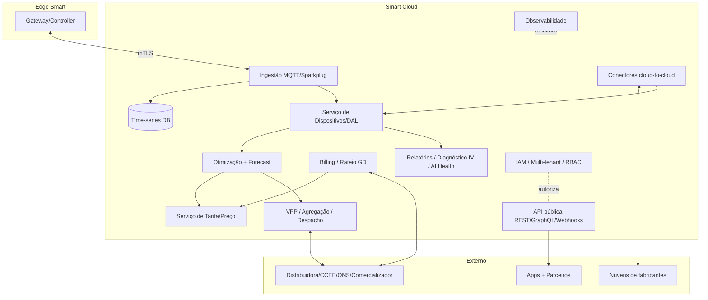
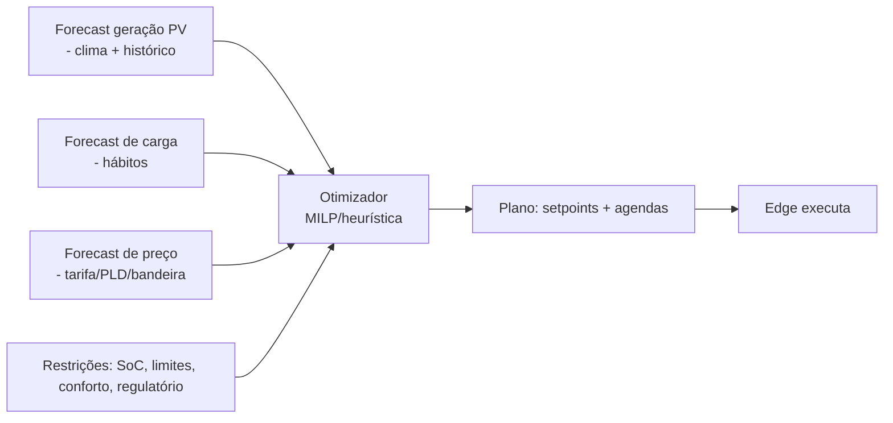
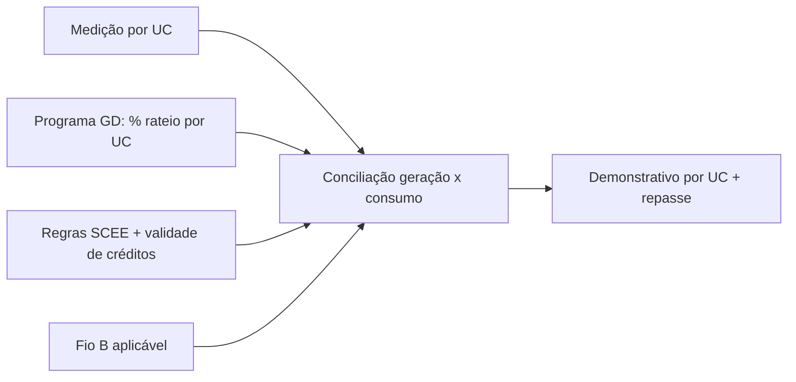

# 08 — Plataforma Cloud e APIs

> A nuvem Smart: onde mora a **inteligência pesada** (otimização, forecast, tarifa, agregação), o **multi-tenant/IAM**, o **billing/rateio de GD**, os **conectores cloud-to-cloud** e a **API pública**. A nuvem **propõe planos**; o [edge](07-especificacao-firmware-edge.md) **executa e protege**.

---

## 1. Arquitetura de microsserviços

| Serviço | Responsabilidade | Camada |
|---|---|---|
| **Ingestão** | recebe telemetria do edge (MQTT/Sparkplug), valida, persiste | `[SW]` |
| **Time-series DB** | armazena métricas canônicas ([04](04-modelo-de-dominio-e-dados.md)) | `[SW]` |
| **Serviço de Dispositivos/DAL** | inventário, estado, capabilities, envio de comandos ao edge | `[SW]` |
| **Otimização + Forecast** | previsão de PV/carga/preço e cálculo de planos/setpoints/agendas | `[SW]` |
| **Tarifa/Preço** | tarifa fixa/branca/bandeiras (cativo) e contrato/PLD (livre) | `[SW]` |
| **VPP/Agregação** | agrega flexibilidade e despacha eventos de grid service | `[SW]` |
| **Billing/Rateio GD** | créditos SCEE, Fio B, rateio multi-UC, conciliação | `[SW]` |
| **Relatórios/Diagnóstico** | relatórios, **diagnóstico IV**, **AI Health**, consistência de bateria (herdados do SEMS) | `[SW]` |
| **IAM/Multi-tenant** | identidade, organizações, RBAC, isolamento | `[SW]` |
| **Conectores cloud** | integração com nuvens de fabricantes ([05](05-integracao-e-conectividade.md)) | `[SW]` |
| **API pública** | REST/GraphQL/Webhooks/streaming p/ parceiros | `[SW]` |
| **Observabilidade** | métricas, logs, tracing, alertas de plataforma | `[SW]` |

---

## 2. Motor de otimização e forecast

- **Objetivo:** minimizar custo (e/ou maximizar receita) respeitando conforto, vida útil da bateria e limites regulatórios.
- **Saída:** plano enviado ao edge (agendas/setpoints), reavaliado periodicamente. Sem nuvem, o edge segue o último plano ([07](07-especificacao-firmware-edge.md)).
- **Dois mundos de preço:** o mesmo motor opera com **tarifa branca/bandeiras (cativo)** e **preço de mercado (livre)** — ver [02](02-contexto-regulatorio-mercado-br.md).
- IA de forecast personalizada por hábito (conceito presente no EzManager das fontes) roda aqui, com inferência leve possível também no edge.

---

## 3. VPP / Agregação e grid services

- Agrega **recursos de flexibilidade** ([04](04-modelo-de-dominio-e-dados.md)) de muitas UCs.
- Recebe sinais (preço/evento) e **despacha** comandos coordenados, respeitando limites locais.
- No Brasil, monetização é **gradual** (ver [02](02-contexto-regulatorio-mercado-br.md)/[11](11-matriz-de-cenarios.md)); o módulo nasce **pronto tecnicamente** e ativa receita quando a regulação permitir.
- Funções viáveis hoje: **curtailment/limitação por ordem da distribuidora** (análogo BR ao §14a), **controle de reativo**, **gestão de demanda contratada**.

---

## 4. Billing / Rateio de GD compartilhada

- Gerencia **geração compartilhada / EMUC / cooperativa** ([02](02-contexto-regulatorio-mercado-br.md)).
- Aplica **rateio configurável**, **validade de créditos** e **Fio B**.
- Gera **demonstrativos por UC** para o gestor de GD e para os participantes.

---

## 5. Multi-tenant e IAM/RBAC

Herda e estende a hierarquia do SEMS (até 5 níveis) com papéis adicionais:

| Papel | Escopo típico |
|---|---|
| **Admin/Distribuidor** | topo da organização |
| **Instalador/Integrador** | frota de UCs que instala/opera |
| **Técnico / Marketer** | subconjunto operacional |
| **Proprietário (morador)** | sua(s) UC(s) |
| **Agregador (VPP)** | portfólio de flexibilidade |
| **Gestor de GD** | programa(s) de GD e UCs participantes |

Isolamento lógico por tenant/UC; **compartilhamento** de usina com permissões e prazo (recurso presente no SEMS); auditoria/logs.

---

## 6. API pública e integrações

| Interface | Uso |
|---|---|
| **REST** | CRUD de UCs, dispositivos, tarifas, comandos, relatórios |
| **GraphQL** | consultas ricas para apps/parceiros |
| **Webhooks** | eventos (alarme, comando concluído, evento de grid service) |
| **Streaming** | telemetria em tempo quase real para parceiros/agregadores |

- A API permite que **terceiros** (comercializadores, agregadores) construam sobre o Smart — espelhando o conceito de **Open-API** das fontes, agora **multimarca**.
- Conectores cloud-to-cloud detalhados em [05](05-integracao-e-conectividade.md).

---

## 7. Capacidades herdadas do SEMS (agora multimarca)

- **Relatórios** de usina e dispositivo + assinatura/push.
- **Diagnóstico IV** (curva I-V) para detecção de falhas em strings.
- **AI Health** (diagnóstico multidimensional) e **consistência de bateria**.
- **OTA de frota** (atualização em lote) — orquestrada pela nuvem, aplicada no [edge](07-especificacao-firmware-edge.md) ou via conector.

---

## 8. Escalabilidade, DR e observabilidade `[PREMISSA]`

- Ingestão e TSDB **escaláveis horizontalmente**; particionamento por tenant/região.
- **DR**: replicação multi-AZ, RPO/RTO definidos por SLA.
- **Observabilidade**: métricas de negócio (UCs ativas, economia agregada) e técnicas (latência de comando, taxa de entrega de telemetria).

Experiência sobre esta plataforma: [09 — Apps e UX](09-apps-web-mobile-e-ux.md).
