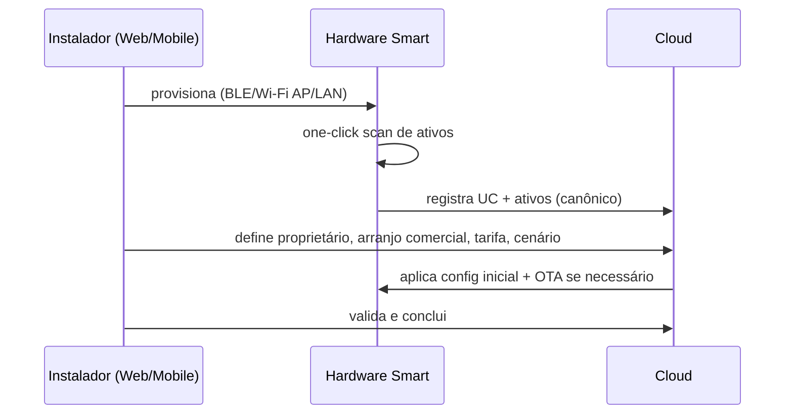
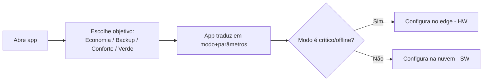

# 09 — Apps Web/Mobile e UX

> As superfícies do Smart por persona ([01](01-visao-e-prd.md)): **Mobile** para o morador, **Web Pro** para instalador/agregador/admin, e **Portal GD** para o gestor de geração compartilhada. Tudo sobre a [plataforma cloud](08-plataforma-cloud-e-apis.md) e o [modelo canônico](04-modelo-de-dominio-e-dados.md), com configuração que pode acontecer no app `[SW]` e/ou no [hardware](06-especificacao-hardware.md) `[HW]`.

---

## 1. Mapa de apps

| App | Persona | Plataforma | Foco |
|---|---|---|---|
| **Smart App (Mobile)** | Morador/proprietário | iOS/Android | economia, conforto, automações, backup, EV |
| **Smart Web Pro** | Instalador, agregador, admin | Web responsivo | comissionamento, frota, O&M, OTA, VPP, API |
| **Portal GD** | Gestor de GD compartilhada | Web | rateio, conciliação, multi-UC, demonstrativos |

> Web Pro herda o que o SEMS+ faz bem (frota, config remota, OTA, diagnóstico) e o torna **multimarca**; o Mobile herda a simplicidade do app do EzManager e amplia para multimarca + cenários BR.

---

## 2. Feature map por persona

| Capacidade | Morador (Mobile) | Instalador (Web Pro) | Agregador (Web Pro) | Gestor GD (Portal) |
|---|---|---|---|---|
| Dashboard de energia/fluxo | ✅ | ✅ frota | ✅ portfólio | ✅ por UC |
| Comissionamento / scan de ativos | guiado | ✅ completo | — | — |
| Seleção de **modo de operação** | ✅ simples | ✅ avançado | ✅ políticas | — |
| Automações / cenas | ✅ | ✅ | — | — |
| Alarmes / notificações | ✅ | ✅ | ✅ | ✅ |
| Relatórios | ✅ | ✅ | ✅ | ✅ |
| OTA / config remota | — | ✅ | — | — |
| Diagnóstico IV / AI Health | resumo | ✅ | — | — |
| EV smart charging | ✅ | ✅ | — | — |
| Billing / rateio GD | minha UC | — | — | ✅ completo |
| Painel VPP / grid services | — | — | ✅ | — |
| API / white-label | — | ✅ | ✅ | ✅ |

---

## 3. Fluxos-chave

### 3.1 Onboarding + comissionamento (instalador)

### 3.2 Seleção de modo de operação (morador)

> O morador escolhe **objetivos**, não parâmetros técnicos; o sistema mapeia para os [modos](10-modos-de-operacao-e-features.md) e decide a camada de execução.

### 3.3 Automação / cena
- Gatilhos: horário, preço/bandeira, excedente PV, SoC da bateria, presença, conexão do VE.
- Ações: ligar/desligar carga, modular EV, ajustar bomba (SG-Ready), mudar modo da bateria.
- Execução: agenda baixada ao edge (`[AMBOS]`).

### 3.4 Billing/rateio (gestor GD)
- Define programa, % por UC, valida medição, gera demonstrativos ([08](08-plataforma-cloud-e-apis.md)).

### 3.5 Painel VPP (agregador)
- Visualiza flexibilidade agregada, cria/observa eventos de grid service, acompanha despacho e (futura) receita ([08](08-plataforma-cloud-e-apis.md)/[11](11-matriz-de-cenarios.md)).

---

## 4. Telas principais (wireframe textual)

- **Home (Mobile):** anel de fluxo de energia (PV/rede/bateria/casa/EV), economia do dia/mês, status de backup (SoC), atalhos de modo.
- **Ativos:** lista por tipo com status, marca/modelo, e ação rápida.
- **Energia:** curvas de potência/energia por dia/mês/ano, autoconsumo e autossuficiência.
- **Automações:** lista de cenas com gatilho→ação.
- **Tarifa/Economia:** estrutura tarifária da UC, bandeiras, e simulação de economia.
- **Web Pro — Frota:** mapa/lista de UCs, alarmes, filtros, ações em lote (OTA).
- **Web Pro — UC:** detalhe com dispositivos, config remota de parâmetros, diagnóstico IV, registros de controle.
- **Portal GD:** programas, UCs participantes, rateio, conciliação, demonstrativos.

---

## 5. Design system, acessibilidade e white-label

- **Design system** único (tokens de cor/tipografia), modo **claro/escuro** (presente no SEMS).
- **Acessibilidade** (contraste, leitor de tela, toque) e **localização** PT-BR primeiro.
- **White-label / multi-marca:** instaladores e comercializadores podem aplicar **sua marca** sobre os apps/portais (logo, cores, domínio) — diferencial para canais; liga-se à API pública ([08](08-plataforma-cloud-e-apis.md)).

---

## 6. O que é `[SW]` vs também `[HW]`

| Ação no app | Onde realmente executa |
|---|---|
| Ver telemetria/relatórios | `[SW]` nuvem |
| Definir objetivo/modo | `[SW]` configura → executa no `[HW]` se crítico |
| Automação por excedente PV/SoC | agenda no `[AMBOS]` (preferência edge) |
| Backup/ilhamento | sempre `[HW]` |
| Config remota de parâmetros do inversor | `[SW]` (via edge/conector) |

Catálogo completo da classificação por camada em [10 — Modos de Operação](10-modos-de-operacao-e-features.md).
