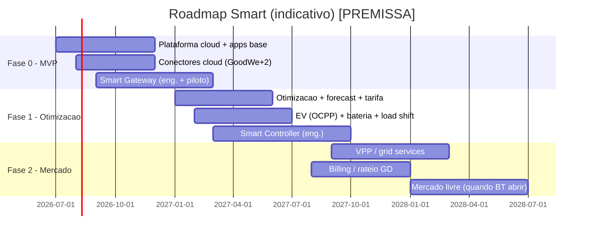

# 12 — Roadmap e Faseamento

> Como construir o Smart por fases, alinhando **níveis de cenário** ([11](11-matriz-de-cenarios.md)), **camadas** (cloud/edge/apps) e **dependências regulatórias** ([02](02-contexto-regulatorio-mercado-br.md)). Cada fase tem critérios de entrada/saída e decisões de **make-vs-buy**.

---

## 1. Linha do tempo (alto nível)

> Datas são **[PREMISSA]**; a Fase 2 (mercado livre/grid services) depende de **gatilhos regulatórios** ([02](02-contexto-regulatorio-mercado-br.md)).

---

## 2. Fases, escopo e critérios

### Fase 0 — MVP (monitorar + autoconsumo + comissionar)
- **Cenários cobertos:** N0–N2 nos arranjos **A** e **B** (visibilidade/billing básico).
- **Entregas:** plataforma cloud (ingestão, TSDB, IAM, relatórios); apps Mobile + Web Pro base; **conectores cloud** (GoodWe Open-API + 2 fabricantes comuns no BR); **Smart Gateway** com drivers locais (Modbus/SunSpec) e modos `[HW]` (autoconsumo, zero-export, backup); comissionamento/scan; OTA.
- **Critério de saída:** comissionar uma UC multimarca em < X min; autoconsumo e backup funcionando offline; telemetria confiável.

### Fase 1 — Otimização (tarifa + EV + cargas)
- **Cenários:** N3–N4 (A/B), preparação de C.
- **Entregas:** motor de **otimização + forecast**; serviço de **tarifa** (branca/bandeiras + dinâmica); **EV smart charging (OCPP)**; **load shifting**; bomba **SG-Ready**; gestão de cargas; **Smart Controller** (medição/relés/backup/4G).
- **Critério de saída:** economia comprovada vs baseline em piloto; modulação de EV por excedente; agendas executando no edge.

### Fase 2 — Mercado (grid services, VPP, livre, GD billing)
- **Cenários:** N5 (A/B/C) + arranjo **C** completo + **B** com billing/rateio pleno.
- **Entregas:** **VPP/agregação** + despacho; **curtailment estilo §14a** + reativo; **billing/rateio GD** completo; **mercado livre** (medição p/ CCEE, contrato/PLD, migração) — **ativado quando a BT abrir**.
- **Critério de saída:** despacho coordenado de portfólio; demonstrativos de rateio corretos; piloto de mercado livre quando regulatoriamente viável.

---

## 3. Make-vs-buy

| Componente | Recomendação | Racional |
|---|---|---|
| **Hardware (Gateway/Controller)** | **Buy/ODM** o módulo (SoC, rádios), **make** o firmware e a integração | rádios pré-certificados aceleram ANATEL ([06](06-especificacao-hardware.md)) |
| **Conectores cloud** | **Make** (núcleo do diferencial agnóstico) | controle da matriz de compatibilidade ([05](05-integracao-e-conectividade.md)) |
| **Motor de otimização/forecast** | **Make** núcleo; **buy** dados meteorológicos/preço | IP central de valor |
| **TSDB / infra** | **Buy** (gerenciado) | foco no produto |
| **Apps** | **Make** | UX por persona é diferencial |
| **VPP/mercado** | **Make** + parcerias com comercializador/agregador | depende de regulação ([02](02-contexto-regulatorio-mercado-br.md)) |

---

## 4. Dependências e gatilhos

- **Regulatórios:** abertura do mercado livre BT; evolução de remuneração de flexibilidade/DR; regras de armazenamento; Fio B (ver [02](02-contexto-regulatorio-mercado-br.md)).
- **Certificação:** ANATEL (rádios), INMETRO/ABNT — caminho crítico do hardware ([06](06-especificacao-hardware.md)).
- **Parcerias:** APIs de fabricantes (acesso a controle), comercializadores/agregadores.
- **Dados:** previsão meteorológica e de preço para o forecast.

---

## 5. Riscos de cronograma (resumo)

| Risco | Mitigação |
|---|---|
| Atraso de homologação ANATEL | usar módulos pré-certificados; iniciar cedo |
| API de fabricante sem controle | priorizar caminho **local** ([05](05-integracao-e-conectividade.md)) |
| Mercado livre BT não abrir no prazo | desacoplar Fase 2-C; entregar A/B antes |
| Otimização complexa | começar heurística, evoluir p/ MILP |

> Riscos completos, premissas e decisões pendentes em [13 — Gaps, Riscos e Decisões](13-gaps-riscos-e-decisoes.md).
