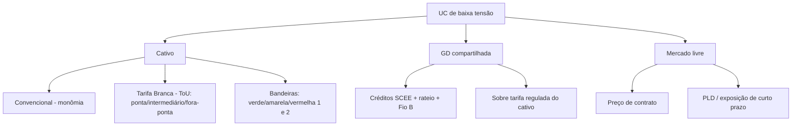
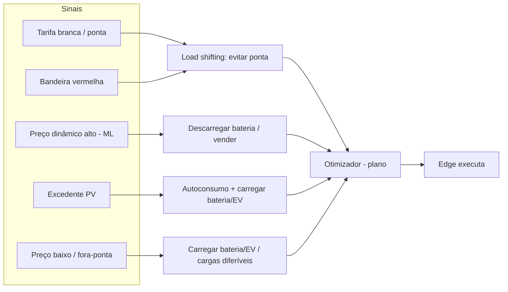
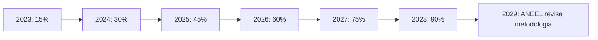

# Artefato — Diagramas de Tarifas e Cenários

> Diagramas (mermaid) que detalham o **mundo de preços** brasileiro e como ele se conecta à [matriz de cenários](../11-matriz-de-cenarios.md) e aos [modos de operação](../10-modos-de-operacao-e-features.md). Complementa [02](../02-contexto-regulatorio-mercado-br.md) e [04](../04-modelo-de-dominio-e-dados.md).

---

## 1. Tipos de tarifa por arranjo



---

## 2. Sinal de preço → modo de operação



> Modos referenciados em [10 — Modos de Operação](../10-modos-de-operacao-e-features.md) (#6 load shifting, #7 otimização, #2 autoconsumo, #8 EV).

---

## 3. Alavancas de valor por nível de ativo

```mermaid
flowchart TB
  N1[N1 +PV] --> v1[Autoconsumo / abate tarifa]
  N2[N2 +Bateria] --> v2[Backup + arbitragem/ponta]
  N3[N3 +EV] --> v3[Carga inteligente com excedente/preço]
  N4[N4 +Load shifting] --> v4[Otimização multi-carga por preço/forecast]
  N5[N5 +Grid services] --> v5[Curtailment/reativo/controle de tensão + (futuro) flexibilidade remunerada]
  v1 --> roi[Economia / Receita]
  v2 --> roi
  v3 --> roi
  v4 --> roi
  v5 --> roi
```

---

## 4. Fio B (rampa de cobrança — GD II)



> Incide sobre o **TUSD Fio B** da **energia injetada**; **autoconsumo instantâneo é isento**. GD I (≤ 6/jan/2023) isenta até 2045. Ver [02](../02-contexto-regulatorio-mercado-br.md).
