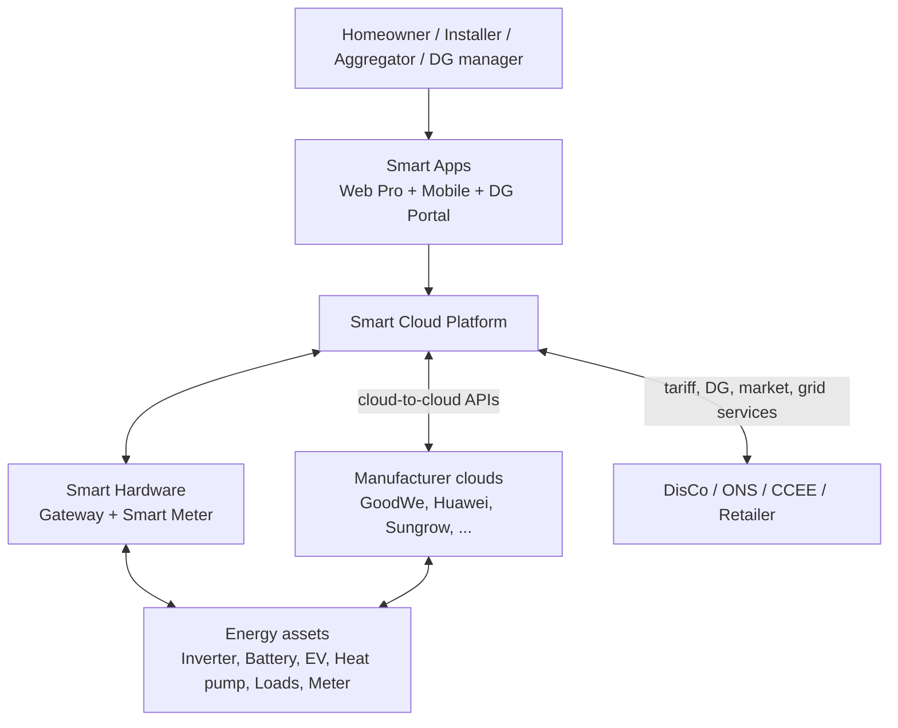
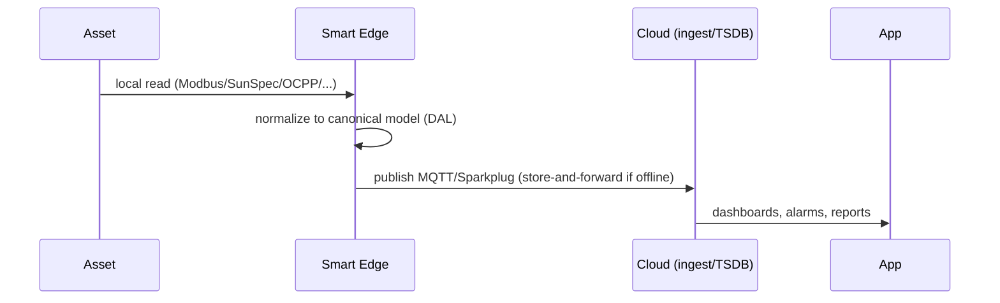
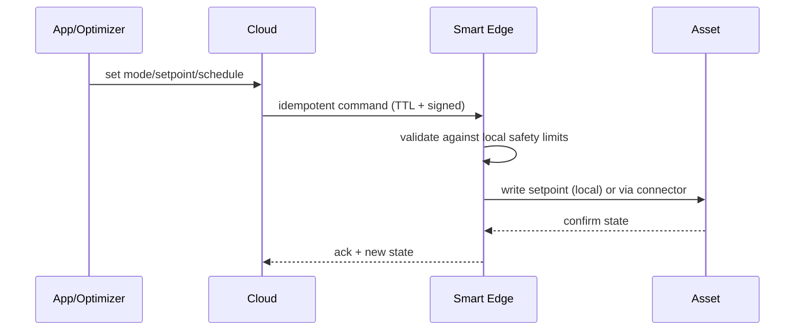

# 03 — System Architecture (EN)

> Reference architecture for Smart: three layers (**edge/hardware**, **cloud**, **apps**) cooperating to deliver monitoring, deterministic control and market intelligence, vendor-agnostic and with a **mixed topology** — each scenario uses only what it needs. PT-BR source: [`../03-arquitetura-de-sistema.md`](../03-arquitetura-de-sistema.md).

---

## 1. Context view

Two paths reach the assets: **local** (edge ↔ assets) and **cloud-to-cloud** (Smart cloud ↔ manufacturer cloud). Path selection per asset is resolved in [05](05-integration-and-connectivity.md).

---

## 2. Layers & responsibilities

| Layer | Responsibilities | Works without internet? |
|---|---|---|
| **Edge (hardware)** | Local discovery/read/write of assets; critical control (self-consumption, backup, zero-export, peak shaving); schedule execution; fail-safe; telemetry buffer | **Yes** `[HW]` |
| **Cloud** | Heavy optimization & forecast; tariff/price; aggregation/VPP; billing/allocation; multi-tenant/IAM; API; cloud-to-cloud connectors; reports/diagnostics | No (edge keeps running locally) |
| **Apps** | Per-persona experience; configuration; visualization; automations; commissioning | Partial (cache) |

Which function runs in which layer is cataloged in [10 — Operation Modes](10-operation-modes-and-features.md).

---

## 3. Deployment topologies (mixed)

| Topology | When | Path | Layer |
|---|---|---|---|
| **Cloud-only (no Smart hardware)** | Simple N0–N1; asset already has cloud API | App ↔ Cloud ↔ manufacturer cloud ↔ asset | `[SW]` |
| **Edge + cloud (recommended)** | N2–N4; needs local control & multi-brand loads | App ↔ Cloud ↔ **Smart Gateway** ↔ assets (local) | `[SW+HW]` |
| **Autonomous edge (offline-capable)** | N2–N5 needing operation without internet | **Smart Gateway** ↔ assets; cloud syncs when back | `[HW]` |

---

## 4. Key flows

### 4.1 Telemetry (asset → cloud)

### 4.2 Control / dispatch (cloud → asset)

> **Principle:** the cloud **proposes**, the edge **disposes** within safe limits. If the cloud drops, the edge keeps executing the last valid schedule (`[HW]`).

---

## 5. Non-functional requirements (NFRs) `[ASSUMPTION]`

| NFR | Target |
|---|---|
| Local control-loop latency (edge) | < 1–2 s for critical actions; sub-cycle protections delegated to the inverter |
| Cloud→edge command latency | < 5 s on a normal network |
| Telemetry rate | 1–10 s local; 1–5 min aggregated to cloud (configurable) |
| Cloud availability | 99.9% |
| Edge offline operation | Indefinite (`[HW]` modes run without cloud) |
| Scale | 10²–10⁶ CUs / 10⁷ telemetry points/day `[ASSUMPTION]` |
| Command security | Idempotency + TTL + signature + local limit validation |

---

## 6. Security architecture

- **Device identity:** secure element/TPM per device, unique X.509 cert, secure boot, signed firmware ([06](06-hardware-specification.md)/[07](07-firmware-edge-specification.md)).
- **Edge↔cloud channel:** **mTLS**; MQTT over TLS; per-tenant/CU isolated topics.
- **Zero-trust:** RBAC and per-CU scope.
- **Multi-tenant:** logical isolation; inherits SEMS' 5-level hierarchy plus aggregator and DG-manager ([08](08-cloud-platform-and-apis.md)).
- **Commands:** signed, idempotent, with **local safety validation** at the edge.
- **Privacy/LGPD:** personal and consumption data handled per LGPD `[TO VERIFY]`.

---

## 7. Edge ↔ cloud communication

- **Telemetry:** **MQTT** (preferably **Sparkplug B**), with edge **store-and-forward**.
- **Command/config:** MQTT command channel (QoS 1+) or gRPC over mTLS, always **idempotent**.
- **OTA:** signed package, **A/B** update with rollback ([07](07-firmware-edge-specification.md)).

Protocols south of the edge in [05](05-integration-and-connectivity.md); data model in [04](04-domain-and-data-model.md).
