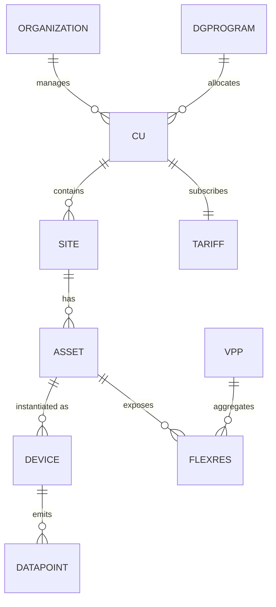

# 04 — Domain & Data Model (EN)

> Domain model and **canonical data model** — the brand-agnostic "common language" all assets are translated into by the [integration layer](05-integration-and-connectivity.md). PT-BR source: [`../04-modelo-de-dominio-e-dados.md`](../04-modelo-de-dominio-e-dados.md).

---

## 1. Entities

| Entity | Description |
|---|---|
| **Organization / Tenant** | Distributor, installer, aggregator or DG manager; up to 5 hierarchy levels |
| **User / Role** | Person + RBAC (owner, technician, installer, aggregator, DG manager, admin) |
| **CU (consumer unit)** | Billable connection point; the regulatory key |
| **Site / Installation** | Physical site (1..N assets); usually 1:1 with CU, but multi-site exists (remote self-consumption) |
| **Energy asset** | Logical concept (PV inverter, battery/ESS, EV charger, heat pump, load, meter) |
| **Device** | Physical instance of an asset, of a brand/model, with address/connector |
| **Data point** | Standardized metric emitted by a device |
| **Flexibility resource** | Dispatchable capability (charge/discharge, modulate, on/off) |
| **Tariff** | Active price/credit structure of the CU |
| **Scenario** | Arrangement×level classification ([11](11-application-scenarios-matrix.md)) |
| **DG program / Allocation** | Shared generation and credit-split rules across CUs |
| **VPP / Grid-service event** | Aggregation and flexibility dispatch |
| **Command / Alarm** | Control action and occurrence |

---

## 2. Canonical telemetry (per asset type)

All drivers/connectors translate native readings to standardized **data points** (fixed names/units/sign). Sign convention: **+ = importing/consuming/charging**, **− = exporting/generating/discharging** (CU's viewpoint). Full superset in [`../integracao/mapa-canonico-capacidades.md`](../integracao/mapa-canonico-capacidades.md).

- **Grid meter:** `grid.power.active` (W, +import/−export), `grid.power.reactive`, `grid.energy.import/export`, `grid.voltage.LN[]`, `grid.frequency`.
- **PV/hybrid inverter:** `pv.power`, `pv.energy.today/total`, `pv.mppt[n].voltage/current/power`, `inv.status`, `inv.temp`, `inv.limit.export` (setpoint).
- **Battery/ESS:** `bat.soc`, `bat.soh`, `bat.power` (+charge/−discharge), `bat.temp`, `bat.cell.vmin/vmax`, `bat.mode`/`bat.limit.power` (setpoint).
- **EV charger:** `ev.state`, `ev.power`, `ev.energy.session`, `ev.current.offered` (setpoint), `ev.soc`.
- **Heat pump (SG-Ready):** `hp.state`, `hp.power`, `hp.sgready.mode` (setpoint), `hp.temp.setpoint`.
- **Generic load:** `load.power`, `load.energy`, `load.switch` (setpoint), `load.priority`.

> Derived points (self-consumption, self-sufficiency, home flow) are **computed** from canonical ones, at the edge and/or cloud.

---

## 3. Tariff, credit & price model

The **Tariff** entity is polymorphic across [Brazilian arrangements](02-regulatory-market-context-br.md):

| Type | Key fields | Arrangement |
|---|---|---|
| **Fixed/conventional** | `price.import`, `price.export` | Captive |
| **White (ToU)** | periods `peak/intermediate/off_peak` with windows + prices | Captive |
| **Flags** | dynamic surcharge `green/yellow/red1/red2` | Captive |
| **Dynamic/market** | price time-series (PLD/contract) + charges | Free market |
| **Demand** (when applicable) | `demand.contracted`, `demand.price` | LV C&I `[TO VERIFY]` |

**DG credit (SCEE):** `credit.balance[CU]` (kWh, with expiry), `feedin.fioB.fraction` (annual Fio B ramp), `DGPROGRAM.allocation[CU] = %`. The optimizer uses these to decide self-consume vs inject vs store.

---

## 4. Identity, units & quality

Stable global IDs (`tenant_id`, `cu_id`, `site_id`, `asset_id`, `device_id`, `point_id`); SI units; UTC timestamps with CU timezone; each sample carries `quality` (good/uncertain/bad) and `source` (edge-local / cloud-connector).

## 5. Time-series & retention `[ASSUMPTION]`

Edge buffer 1–10 s (hours–days); cloud hot TSDB 1 min (13 months); cold downsample 15 min/1 h (5–10 years); events/alarms/commands per event (5 years).

The canonical model is the contract linking [integration](05-integration-and-connectivity.md), [edge](07-firmware-edge-specification.md), [cloud](08-cloud-platform-and-apis.md) and [apps](09-web-mobile-apps-and-ux.md).
