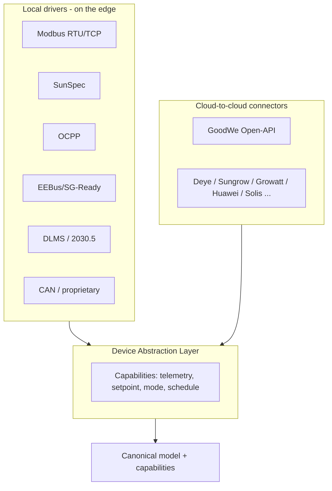
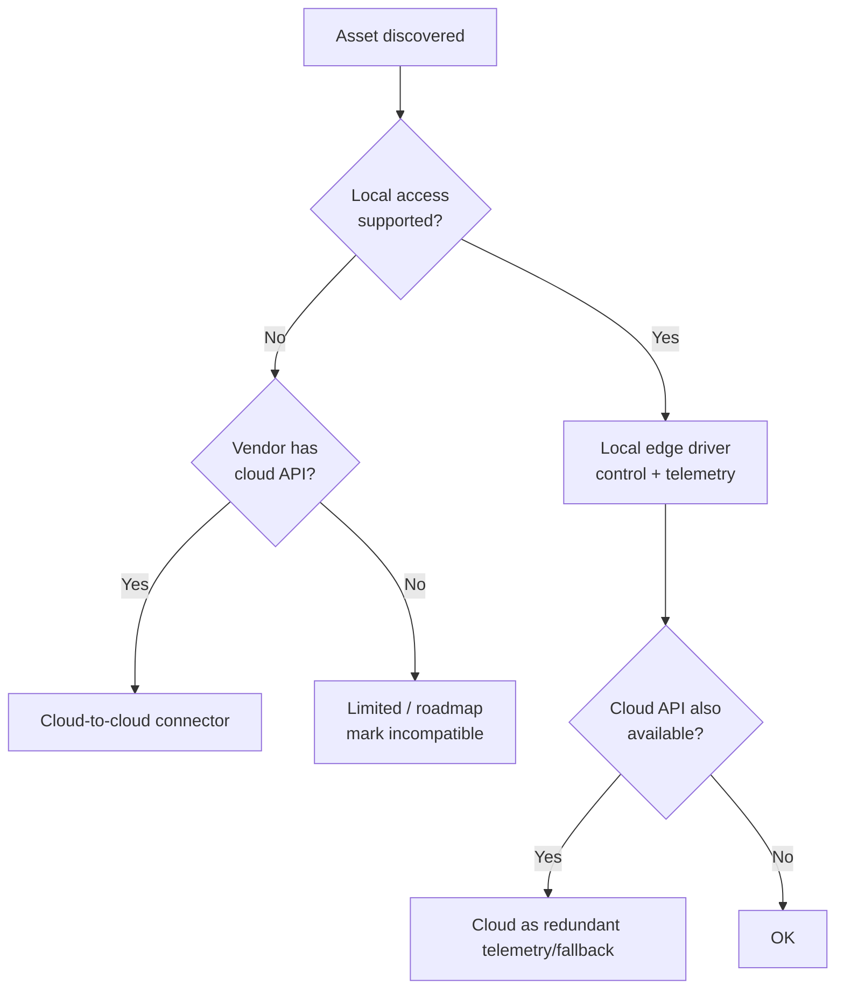

# 05 — Integration & Connectivity (vendor-agnostic) (EN)

> How Smart talks to **any asset of any brand**, via **two paths** (local on the hardware and cloud-to-cloud) under a single abstraction. PT-BR source: [`../05-integracao-e-conectividade.md`](../05-integracao-e-conectividade.md).

---

## 1. Device Abstraction Layer (DAL)

Every integration is translated to the **canonical model** ([04](04-domain-and-data-model.md)). The DAL exposes each device by **capabilities**, not by brand.

**Capability contract (internal):** `telemetry` (read), `setpoint` (read/write), `mode` (read/write), `schedule` (read/write), `meta` (read). Each driver/connector declares **which capabilities** it supports and **by which path**. When both exist, the DAL prefers **local** for control (latency/offline) and uses the cloud as fallback/telemetry — see §4.

---

## 2. Local protocols (run on Smart hardware `[HW]`/`[SW+HW]`)

| Protocol | Use | Asset class | Notes |
|---|---|---|---|
| **Modbus RTU (RS485)** | read/write registers | inverter, battery, meter | per-vendor maps; needs profile library |
| **Modbus TCP (LAN)** | same over Ethernet | inverter, meter, PCS | |
| **SunSpec Modbus** | standardized models | inverter (101/102/103), storage (124), meter (201–204), battery (802+) | **preferred** when supported |
| **OCPP 1.6 / 2.0.1** | EV charger control | EV charger | smart charging profiles |
| **EEBus (SPINE)** / **SG-Ready** | heat-pump management | heat pump | SG-Ready = 4 states via 2 DIs/relays |
| **DLMS/COSEM** | meter reading | smart meter | regulatory/bidirectional |
| **IEEE 2030.5 (CSIP)** | standardized DER control | inverter/DER | relevant for grid services/ordered curtailment |
| **IEC 61850** | larger DER/substation | mini/large DER | optional, N5/C&I |
| **Matter (Energy)** | smart-home devices | loads, plugs | emerging |
| **CAN** | proprietary BMS/PCS | battery | per vendor |

> The **Smart Gateway** ([06](06-hardware-specification.md)) provides **RS485 ×N, Ethernet, Wi-Fi/BT, DI/DO (signal)/AI, CAN** and **optional 4G**; metering comes from the **Smart Meter** (dedicated or integrated). Smart plugs (Shelly-class, as in the sources, plus Matter/Wi-Fi/Zigbee equivalents) provide `load.power` + `load.switch`.

---

## 3. Cloud-to-cloud connectors (run in Smart cloud `[SW]`)

When there's **no local access** (or for redundancy), Smart integrates the **manufacturer cloud** via API. Capabilities vary widely; all field/limit details are `[TO VERIFY]` against official docs and partnerships.

**Connector priority (user decision):** **GoodWe · Deye · Sungrow · Growatt · Huawei · Solis** — highest LV presence in Brazil. Others come later.

| Priority | Vendor / API | Read | Control (write) | Notes |
|---|---|---|---|---|
| 1 | **GoodWe — SEMS Open-API** | Yes (raw + processed) | **Yes (batch control)** — per the white paper | Preferred for GoodWe assets without edge; exact fields `[TO VERIFY]` |
| 2 | **Deye — Solarman (OSS/OpenAPI)** | Yes | Partial | very common in BR |
| 3 | **Sungrow — iSolarCloud OpenAPI** | Yes | Limited | `[TO VERIFY]` |
| 4 | **Growatt — OpenAPI / Solarman** | Yes | Partial | common in BR; semi-public maps |
| 5 | **Huawei — FusionSolar (Northbound)** | Yes | Limited | control often partner-restricted |
| 6 | **Solis — SolisCloud API / Solarman** | Yes | Limited | `[TO VERIFY]` |
| — | SolarEdge / Fronius / Enphase / Tesla | Yes | None/Limited/Partial | later phase |

> **Product rule:** critical deterministic control **must** prefer the **local** path; cloud connectors serve **universal monitoring** and **control where the vendor allows it**. Known limitations must be surfaced to the user.

---

## 4. Local ↔ cloud strategy (per asset)

- **Control:** local > cloud. **Telemetry:** prefer local; use cloud to fill gaps. **Source conflict:** `source`/`quality` ([04](04-domain-and-data-model.md)) sets priority; never two paths writing a setpoint at once (per-asset lock at the edge).

---

## 5. Compatibility matrix & certification

Per supported model, keep a compatibility sheet (brand/model/firmware, path, capabilities, limits, Smart certification status). Onboarding a vendor: acquire the map (Modbus datasheet / SunSpec / API doc / partnership) → implement driver/connector against the canonical model → hardware-in-the-loop tests → security validation (the Smart **never** disables inverter protections; respects anti-islanding) → publish in the matrix. Details and templates in [`../integracao/`](../integracao/00-modelo-de-abstracao.md).

---

## 6. Per-layer classification

| Integration path | Layer |
|---|---|
| Local drivers (Modbus/SunSpec/OCPP/EEBus/DLMS/2030.5/CAN) | `[HW]` / `[SW+HW]` |
| Cloud-to-cloud connectors | `[SW]` |
| Path decision & canonical model | `[SW+HW]` (logic mirrored edge+cloud) |

> Hardware running local drivers: [06](06-hardware-specification.md). Control/optimization consuming these capabilities: [07](07-firmware-edge-specification.md) (edge) and [08](08-cloud-platform-and-apis.md) (cloud).
