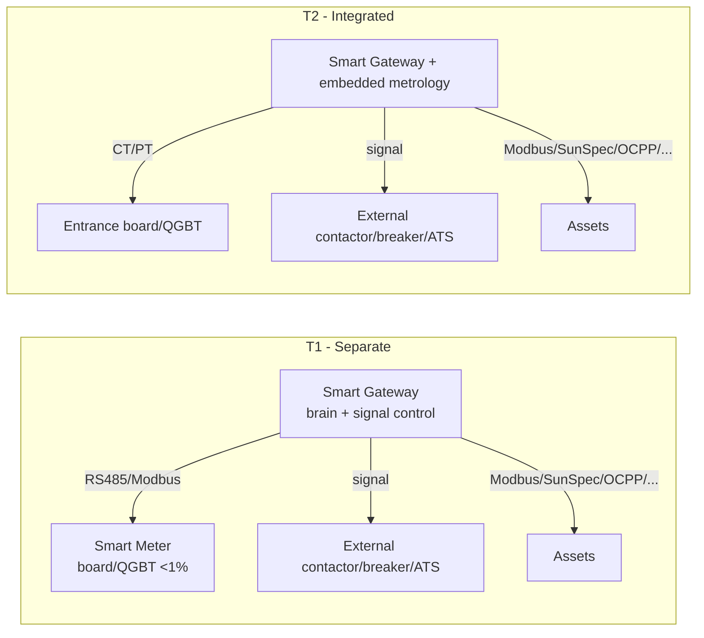
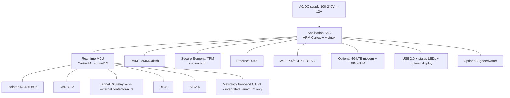

# 06 — Hardware Specification (Smart family) (EN)

> **OEM/ODM-level** specification (buildable with market SoC/modules, no PCB from scratch) of Smart's proprietary hardware. The family has **two elements** — the **Smart Gateway** (the HEMS/brain, controlling via **signal**) and the **Smart Meter** (commodity metering) — which can be **separate** or **integrated in the same unit**. Physical comms enable the [local drivers](05-integration-and-connectivity.md); embedded software in [07](07-firmware-edge-specification.md). PT-BR source: [`../06-especificacao-hardware.md`](../06-especificacao-hardware.md).

> Component ranges/choices `[ASSUMPTION]`; certifications `[TO VERIFY]`.

---

## 1. Hardware principles (locked decisions)

1. **Gateway = controller (single unit).** No separate "Controller" SKU: the **Smart Gateway** is both the HEMS brain and the controller.
2. **Signal-level control, not power switching.** The Gateway drives loads/transfer via **signal-level relay/IO** (dry contact / logic level). **Power switching is external**: contactor, motorized breaker or **ATS** from third parties. The Gateway never carries load current.
3. **Metering is a commodity.** The **Smart Meter** may be proprietary or OEM/ODM; essential requirement is **< 1% accuracy**, installed at the **entrance board or QGBT**.
4. **Two topologies:** **T1 — Separate** (Gateway + Smart Meter; Gateway reads the meter via RS485/Modbus); **T2 — Integrated** (metering **built into** the Gateway).

---

## 2. Smart Gateway — block diagram

### Target spec `[ASSUMPTION]`

| Item | Smart Gateway |
|---|---|
| **Application SoC** | ARM Cortex-A (i.MX8M / RK3568 class), Linux |
| **Co-processor** | Cortex-M MCU for I/O and deterministic control |
| **Memory** | ≥ 1 GB RAM, ≥ 8–16 GB eMMC |
| **Security** | Secure Element/TPM, secure boot, per-device X.509 |
| **Asset comms** | Isolated RS485 ×4–6, CAN ×1–2, Modbus RTU/TCP, SunSpec |
| **Network (WAN/LAN)** | Ethernet, Wi-Fi 2.4/5 GHz, BT 5.x, **optional 4G/LTE** |
| **Smart home** | Zigbee/Matter (optional), Wi-Fi smart plugs |
| **Control (outputs)** | **Signal DO/relay ×4** (dry contact) → commands **external contactor/breaker/ATS**; does **not** switch power |
| **Inputs** | DI ×8, AI ×2–4 |
| **Metrology** | **integrated variant (T2) only**: **CT/PT** inputs, **< 1%** accuracy |
| **Capacity** | many inverters/batteries, EV, SG-Ready heat pump, dozens of smart plugs (exceeds EzManager's fixed limits) |
| **UI** | Status LEDs, USB 2.0, optional display |
| **Power** | AC 100–240 V → 12 V DC; ≤ ~7–10 W |
| **Mechanical** | DIN / wall / desktop |
| **Environmental** | −25…+60 °C, 0–95% RH non-condensing, IP20 |

> **Backup/islanding** is coordinated by the Gateway **commanding** transfer (signal → external ATS/contactor) and dialoguing with the hybrid inverter; the Gateway **respects the inverter's anti-islanding** ([02](02-regulatory-market-context-br.md)/[07](07-firmware-edge-specification.md)).

---

## 3. Smart Meter (metering) — commodity

| Item | Smart Meter |
|---|---|
| **Function** | measure energy/power/voltage/current (bidirectional) at the connection point |
| **Location** | **entrance board** or **QGBT** |
| **Accuracy (EMS metering)** | **< 1% deviation** — target **class 1 (IEC 62053-21/22)**, recommended **0.5S** headroom (≈ INMETRO class C/B) |
| **Supply** | **commodity** — proprietary **or** market OEM/ODM |
| **Phases** | single/split/three-phase per CU; CT inputs |
| **Comms** | **RS485 (Modbus-RTU)** to the Gateway; optional Modbus-TCP/M-Bus |
| **Note** | in **T2 (integrated)** topology this function lives **inside** the Gateway |

> For levels requiring **peak shaving / zero-export / grid services** ([10](10-operation-modes-and-features.md)), use a **dedicated Smart Meter** (T1) or the **integrated** variant (T2) — don't rely solely on the inverter's internal meter.

> **EMS metering vs billing.** By default the Smart Meter is an **EMS meter** (control: peak shaving, zero-export, self-consumption); the **official billing meter** remains the **DisCo's** (bidirectional DG, **PRODIST Module 5** / REN 956/2021) or the **SMF** meter (free market). If the Smart Meter is used for **billing/settlement**, it needs an **INMETRO-approved model** (RTM **Ordinance 587/2012** — classes D 0.2% / C 0.5% / B 1.0% / A 2.0%) and must meet **PRODIST Module 5** (bidirectional; differentiate consumed vs injected energy) and **SMF** requirements (mass memory at 5–60 min intervals for ≥ 32 days, RTC synchronizable to GMT-3, ABNT/IEC compliance). `[TO VERIFY class required per use]`

---

## 4. Variants / SKUs

| Variant | Description | When |
|---|---|---|
| **Smart Gateway (base)** | brain + comms + signal control; no own metrology | T1, reads external Smart Meter or inverter meter |
| **Smart Gateway + metrology (integrated)** | above + internal CT/PT (< 1%) | T2, single-box |
| **Smart Meter** | commodity < 1% meter at the board | T1, paired with base Gateway |

> No "Smart Controller" anymore: its former capabilities (metering, transfer, 4G, more I/O) become **Gateway options** (integrated metrology, 4G) and **signal-level command** of external power equipment.

---

## 5. Indicative BOM class `[ASSUMPTION]`

SoM Cortex-A (i.MX8M Mini / RK3568) + STM32-class MCU; LPDDR4 1–2 GB + eMMC 8–16 GB; SE/TPM (ATECC/OPTIGA class); isolated RS485 transceivers, Ethernet PHY, certifiable Wi-Fi/BT module, optional 4G module; metrology AFE + CT inputs (T2); **signal** relays / dry-contact outputs (no power conduction); AC/DC supply + surge protection; DIN/wall enclosure. Prefer **pre-certified radios** to cut ANATEL cost/time. `[TO VERIFY]`

---

## 6. Brazil certifications

| Domain | Requirement | Status |
|---|---|---|
| **RF** | Mandatory **ANATEL homologation** (Wi-Fi/BT/4G) | `[TO VERIFY]` — use pre-certified modules |
| **Electrical safety** | ABNT/NBR for electronics; install per NBR 5410 | `[TO VERIFY]` |
| **Metrology (Smart Meter)** | < 1% accuracy; possible metrological approval (INMETRO meter ordinance) for billing use | `[TO VERIFY class/use]` |
| **INMETRO inverters (140/2022 + 515/2023)** | applies to the **inverter**, **not** the Smart Gateway/Meter | see [02](02-regulatory-market-context-br.md) |
| **EMC** | electromagnetic compatibility testing | `[TO VERIFY]` |

> The Gateway is a **controller/gateway**; the Meter is a **meter**. **Neither** replaces the **inverter's** regulatory protections (anti-islanding, limits) — a firmware ([07](07-firmware-edge-specification.md)) and regulatory ([02](02-regulatory-market-context-br.md)) requirement.

---

## 7. On-device user interfaces

Status LEDs (power, cloud, assets, fault); USB for service/diagnostics; optional display; BLE/Wi-Fi AP for app provisioning during commissioning ([09](09-web-mobile-apps-and-ux.md)).

Next: [07 — Firmware/Edge](07-firmware-edge-specification.md).
