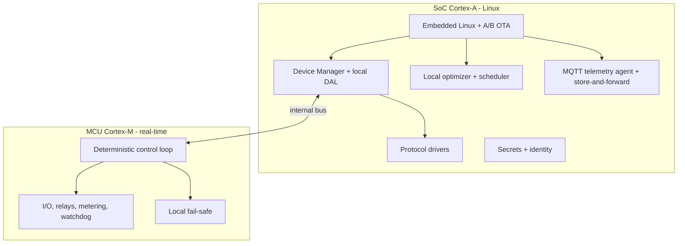

# 07 — Firmware / Edge Specification (EN)

> The edge software of the [Smart hardware](06-hardware-specification.md): what runs **locally**, guarantees **deterministic and offline control**, executes critical [operation modes](10-operation-modes-and-features.md) and talks to the [cloud](08-cloud-platform-and-apis.md) over MQTT. This is where many functions "that could only be done in the app" now run **on the hardware** — the product's core ask. PT-BR source: [`../07-especificacao-firmware-edge.md`](../07-especificacao-firmware-edge.md).

---

## 1. Embedded stack

- **SoC (Linux):** DAL, drivers, local optimization, telemetry, OTA, security.
- **MCU (real-time):** deterministic control, I/O, metering, **fail-safe** that works even if Linux hangs.

---

## 2. Modules

| Module | Function | Layer |
|---|---|---|
| Device Manager + local DAL | discovery (one-click scan), inventory, canonical translation ([04](04-domain-and-data-model.md)) | `[HW]` |
| Protocol drivers | Modbus RTU/TCP, SunSpec, OCPP, EEBus/SG-Ready, DLMS/2030.5, CAN ([05](05-integration-and-connectivity.md)) | `[HW]` |
| Local optimizer + scheduler | execute schedules/dispatch rules; cloud-optimizer fallback | `[HW]` |
| Control loop (MCU) | apply setpoints at low latency; read metering; drive signal relays | `[HW]` |
| Fail-safe / local protection | safety rules independent of cloud (limits, zero-export, intentional islanding) | `[HW]` |
| Telemetry agent | publish MQTT/Sparkplug; **store-and-forward** when offline | `[SW+HW]` |
| OTA | signed A/B update with rollback | `[SW+HW]` |
| Security | secure boot, X.509 identity, secrets, mTLS | `[HW]` |

---

## 3. Operation modes executed at the edge

| Mode | Why at the edge | Tag |
|---|---|---|
| Self-consumption | fast PV↔load↔battery loop | `[HW]` |
| Backup / intentional islanding | immediate local transition (signal → external ATS) | `[HW]` |
| Zero-export / injection limit | fast response to not violate regulatory limit | `[HW]` |
| Peak shaving / demand limit | measure & act in seconds (Smart Meter/integrated) | `[HW]` |
| Load shifting (schedule) | schedule from cloud, **executed** locally | `[BOTH]` |
| EV smart charging | modulate current vs PV surplus in real time | `[SW+HW]` |
| Grid-service dispatch | receives cloud/VPP signal, **executes** with local guarantees | `[SW+HW]` |
| Reactive / power-factor control | fast loop next to the inverter | `[HW]` |

> **Golden rule:** the cloud computes the **plan** (forecast/optimization/price); the edge **executes and protects**. Without cloud, the edge follows the last valid plan and safety rules.

---

## 4. Offline behavior

`[HW]` modes keep running (self-consumption, backup, zero-export, peak shaving, already-downloaded schedules); telemetry is **buffered** and re-sent on reconnect; cloud commands have a **TTL** (stale commands expire, avoiding obsolete actions).

## 5. Latency & determinism `[ASSUMPTION]`

Local asset read 1–10 s; local setpoint apply < 1–2 s; MCU protection/fail-safe tens of ms; backup transition per hybrid inverter. **Time-critical regulatory protections (anti-islanding) stay in the inverter** — the edge respects, not replaces them ([02](02-regulatory-market-context-br.md)/[06](06-hardware-specification.md)).

## 6. OTA, watchdog & recovery

A/B OTA (two slots, validate-then-switch, automatic rollback); signed firmware (secure boot rejects unsigned images); MCU watchdog keeps fail-safe and reboots the SoC on hang; device profile packages can extend the [compatibility matrix](05-integration-and-connectivity.md) without changing base firmware.

## 7. Edge security

Boot integrity (secure boot chained to SE/TPM); per-device X.509 identity; mTLS to cloud (MQTT over TLS); secrets in SE/TPM; signed/idempotent commands validated against local limits; signed updates with rollback; minimal attack surface. The edge **validates every command locally**: an unsafe or non-compliant setpoint is **rejected by the hardware**, regardless of origin.
