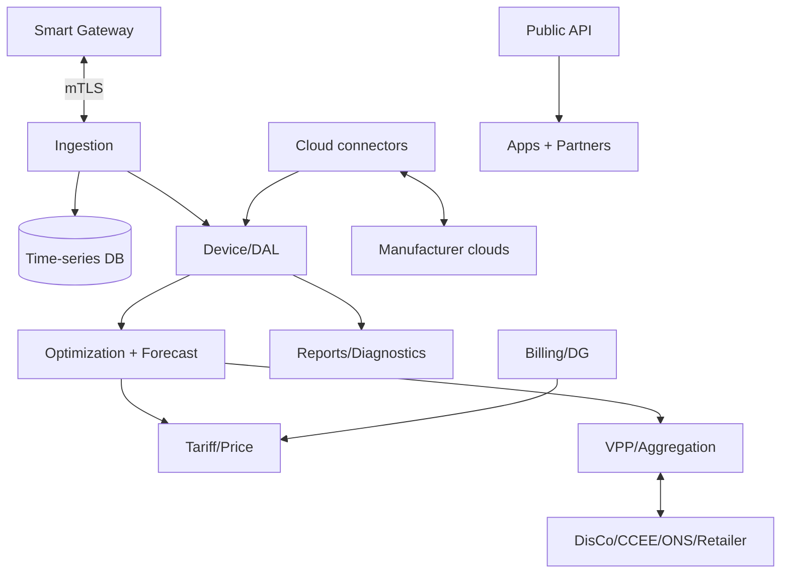
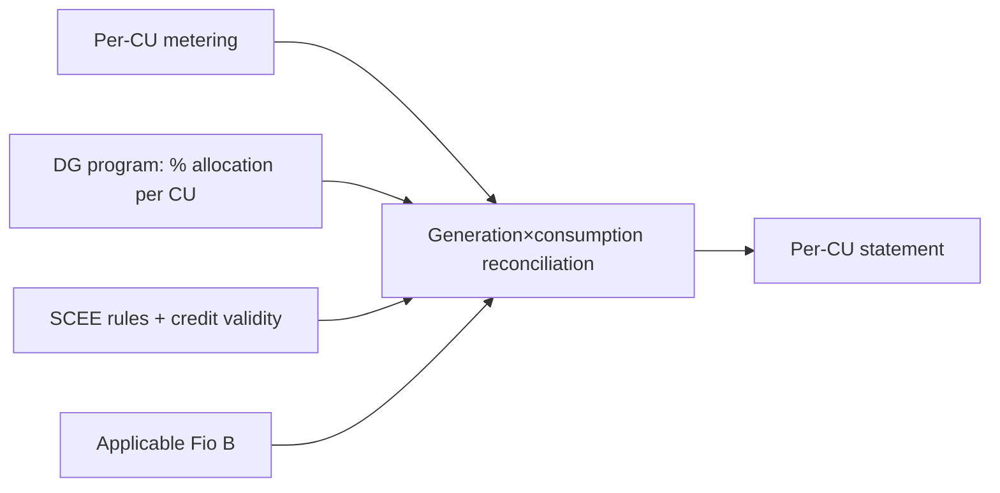

# 08 — Cloud Platform & APIs (EN)

> The Smart cloud: home of the **heavy intelligence** (optimization, forecast, tariff, aggregation), **multi-tenant/IAM**, **billing/DG allocation**, **cloud-to-cloud connectors** and the **public API**. The cloud **proposes plans**; the [edge](07-firmware-edge-specification.md) **executes and protects**. PT-BR source: [`../08-plataforma-cloud-e-apis.md`](../08-plataforma-cloud-e-apis.md).

---

## 1. Microservices

| Service | Responsibility |
|---|---|
| **Ingestion** | receive edge telemetry (MQTT/Sparkplug), validate, persist |
| **Time-series DB** | store canonical metrics ([04](04-domain-and-data-model.md)) |
| **Device/DAL service** | inventory, state, capabilities, command dispatch to edge |
| **Optimization + Forecast** | PV/load/price forecasting; compute plans/setpoints/schedules |
| **Tariff/Price** | fixed/white/flags (captive) and contract/PLD (free) |
| **VPP/Aggregation** | aggregate flexibility, dispatch grid-service events |
| **Billing/DG allocation** | SCEE credits, Fio B, multi-CU allocation, reconciliation |
| **Reports/Diagnostics** | reports, **IV diagnostics**, **AI Health**, battery consistency (inherited from SEMS, now multi-brand) |
| **IAM/Multi-tenant** | identity, organizations, RBAC, isolation |
| **Cloud connectors** | integration with manufacturer clouds ([05](05-integration-and-connectivity.md)) |
| **Public API** | REST/GraphQL/Webhooks/streaming for partners |
| **Observability** | platform metrics, logs, tracing, alerts |

---

## 2. Optimization & forecast

- **Objective:** minimize cost (and/or maximize revenue) within comfort, battery life and regulatory limits.
- **Output:** a plan sent to the edge (schedules/setpoints), re-evaluated periodically. Without cloud, the edge follows the last plan ([07](07-firmware-edge-specification.md)).
- **Two price worlds:** the same engine works with **white/flags (captive)** and **market price (free)** ([02](02-regulatory-market-context-br.md)).
- Habit-based forecasting IA (present in EzManager from the sources) runs here, with light edge inference possible.

---

## 3. VPP / Aggregation & grid services

Aggregates **flexibility resources** ([04](04-domain-and-data-model.md)) from many CUs; receives signals (price/event) and **dispatches** coordinated commands within local limits. In Brazil, monetization is **gradual** ([02](02-regulatory-market-context-br.md)/[11](11-application-scenarios-matrix.md)); the module is born **technically ready**. Near-term viable: **ordered curtailment**, **voltage/reactive control**, **contracted demand management**.

---

## 4. Billing / shared-DG allocation

Manages shared generation / EMUC / cooperative; applies **configurable allocation**, **credit validity** and **Fio B**; produces **per-CU statements** for the DG manager and participants.

---

## 5. Multi-tenant & IAM/RBAC

Inherits SEMS' 5-level hierarchy. The **4 personas** ([01](01-vision-and-prd.md)) map to **roles** with explicit **permissions**.

| Persona | Roles |
|---|---|
| Homeowner | Owner, Visitor |
| Installer/integrator | Org admin, Installer, Technician |
| Retailer/aggregator | Aggregator (VPP) |
| Shared-DG manager | DG manager |
| (all) | Support/Auditor (read + logs) |

**Permission matrix (summary):** view telemetry/reports, control mode/setpoint, commission/configure, OTA, manage tariff/contract, billing/DG allocation, VPP dispatch, manage users/org, public-API access — granted per role on a least-privilege basis (atomic permissions; custom roles for white-label partners). Per-tenant/CU isolation; plant sharing with permissions and expiry; full audit/logs.

---

## 6. Public API & integrations

REST (CRUD of CUs, devices, tariffs, commands, reports), GraphQL (rich queries), Webhooks (alarm, command completed, grid-service event), Streaming (near-real-time telemetry). Mirrors the sources' **Open-API** concept, now **multi-brand**. Contract draft: [`../artefatos/openapi.yaml`](../artefatos/openapi.yaml). Connectors in [05](05-integration-and-connectivity.md).

---

## 7. Inherited SEMS capabilities (now multi-brand)

Plant & device **reports** + subscription/push; **IV diagnostics** (I-V curve); **AI Health** and **battery consistency**; **fleet OTA** orchestrated by the cloud, applied at the [edge](07-firmware-edge-specification.md) or via connector.

---

## 8. Scalability, DR & observability `[ASSUMPTION]`

Horizontally scalable ingestion and TSDB; partitioning per tenant/region; multi-AZ DR with SLA-defined RPO/RTO; business (active CUs, aggregate savings) and technical (command latency, telemetry delivery) observability.

Experience on top of this platform: [09 — Apps & UX](09-web-mobile-apps-and-ux.md).
