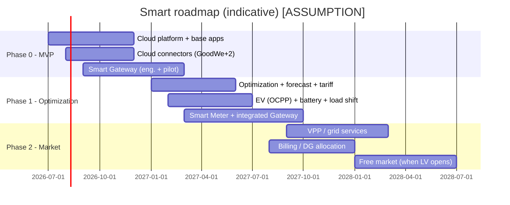

# 12 — Roadmap & Phasing (EN)

> How to build Smart in phases, aligning **scenario levels** ([11](11-application-scenarios-matrix.md)), **layers** (cloud/edge/apps) and **regulatory dependencies** ([02](02-regulatory-market-context-br.md)). PT-BR source: [`../12-roadmap-e-faseamento.md`](../12-roadmap-e-faseamento.md).

---

## 1. Timeline (high level)

> Dates are `[ASSUMPTION]`; Phase 2 (free market/grid services) depends on **regulatory triggers** ([02](02-regulatory-market-context-br.md)).

---

## 2. Phases

- **Phase 0 — MVP:** N0–N2 (A/B). Cloud platform (ingest, TSDB, IAM, reports); Mobile + Web Pro base; **cloud connectors** (GoodWe + 2 common BR brands); **Smart Gateway** with local drivers and `[HW]` modes (self-consumption, zero-export, backup); commissioning/scan; OTA. Exit: commission a multi-brand CU in < X min; self-consumption & backup working offline.
- **Phase 1 — Optimization:** N3–N4 (A/B), prepare C. Optimization + forecast; tariff service (white/flags + dynamic); **EV smart charging (OCPP)**; load shifting; SG-Ready; load management; **Smart Meter / integrated Gateway**. Exit: proven savings vs baseline; EV modulation by surplus; schedules running at edge.
- **Phase 2 — Market:** N5 (A/B/C) + full arrangement C + B billing/allocation. **VPP/aggregation**; **§14a-style curtailment** + reactive; **DG billing/allocation**; **free market** (CCEE metering, contract/PLD, migration) — **activated when LV opens** (Law 15,269/2025). Exit: coordinated portfolio dispatch; correct allocation statements.

---

## 3. Make-vs-buy

| Component | Recommendation | Rationale |
|---|---|---|
| **Hardware (Gateway + Smart Meter)** | **Buy/ODM** module (SoC, radios) and commodity meter; **make** firmware & integration | pre-certified radios speed ANATEL ([06](06-hardware-specification.md)) |
| **Cloud connectors** | **Make** (core of the agnostic differentiator) | control of the compatibility matrix ([05](05-integration-and-connectivity.md)) |
| **Optimization/forecast** | **Make** core; **buy** weather/price data | central value IP |
| **TSDB / infra** | **Buy** (managed) | focus on product |
| **Apps** | **Make** | per-persona UX is a differentiator |
| **VPP/market** | **Make** + retailer/aggregator partnerships | depends on regulation ([02](02-regulatory-market-context-br.md)) |

---

## 4. Dependencies & triggers

Regulatory: LV free-market opening; flexibility/DR remuneration; storage rules; Fio B ([02](02-regulatory-market-context-br.md)). Certification: ANATEL (radios), INMETRO/ABNT — hardware critical path ([06](06-hardware-specification.md)). Partnerships: manufacturer APIs (control access), retailers/aggregators. Data: weather and price forecasts.

## 5. Schedule risks

ANATEL homologation delay → pre-certified modules, start early. Manufacturer API without control → prioritize local path. LV free market slipping → decouple Phase 2-C; ship A/B first. Optimization complexity → start heuristic, evolve to MILP.

> Full risks, assumptions and pending decisions in [13 — Gaps, Risks & Decisions](13-gaps-risks-and-decisions.md).
