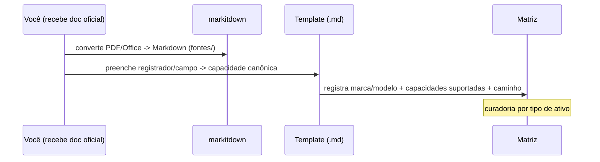

# Integração — Modelo de Abstração

> Como o Smart representa **qualquer dispositivo de qualquer marca** de forma uniforme, e como **você adiciona mapas de fabricantes** (Modbus/SunSpec e APIs) ao longo do tempo. Este é o "esqueleto vivo" da [camada de integração](../05-integracao-e-conectividade.md): aqui ficam o **mapa canônico de capacidades**, os **templates por fabricante** e a **matriz de compatibilidade**.

---

## 1. Conceitos

```mermaid
flowchart TB
  cap[Mapa Canônico de Capacidades\n(superset, agnóstico)]
  drv[Driver/Conector por fabricante\n(Modbus/SunSpec ou API)]
  map[Mapa do fabricante\n(registrador/campo -> capacidade canônica)]
  comp[Matriz de Compatibilidade\n(marca x modelo x tipo x capacidade)]
  cap --> map
  drv --> map
  map --> comp
```

- **Capacidade canônica** — uma função padronizada (ex.: `bat.power.setpoint`) com id, tipo, unidade, leitura/escrita e tipo de ativo. Independe de marca. Ver [mapa-canonico-capacidades.md](mapa-canonico-capacidades.md).
- **Mapa do fabricante** — documento `.md` que liga os **registradores Modbus/SunSpec** ou os **campos de API** de um modelo específico às **capacidades canônicas**. Você preenche a partir do datasheet oficial.
- **Matriz de compatibilidade** — banco que diz **quais capacidades** cada **marca/modelo** suporta e por **qual caminho** (local/cloud). Ver [matriz-compatibilidade.md](matriz-compatibilidade.md).

---

## 2. Contrato de capability (resumo)

Cada dispositivo, depois de mapeado, expõe um conjunto de capacidades. Campos de uma capacidade:

| Campo | Descrição |
|---|---|
| `id` | identificador canônico (ex.: `inv.ac.power`) |
| `tipo` | `telemetria` · `setpoint` · `modo` · `config` |
| `asset` | tipo de ativo (`inverter`, `battery`, `meter`, `ev`, `heatpump`, `load`) |
| `unidade` | W, Wh, V, A, %, °C, Hz, enum, bool |
| `acesso` | `R`, `W`, `RW` |
| `caminho` | `local` (Modbus/SunSpec/OCPP/...) e/ou `cloud` (API) |
| `origem` | como obter (registrador/endpoint) — definido no mapa do fabricante |

---

## 3. Estrutura de pastas (proposta)

```
docs/smart/integracao/
├── 00-modelo-de-abstracao.md          (este arquivo)
├── mapa-canonico-capacidades.md       (superset de capacidades)
├── template-fabricante-modbus.md      (modelo p/ mapa Modbus/SunSpec)
├── template-fabricante-api.md         (modelo p/ mapa de API cloud)
├── matriz-compatibilidade.md          (DB marca×modelo×tipo×capacidade)
├── PROMPT-projeto-externo.md          (prompt da sessão externa de ingestão)
├── fabricantes/                       (a popular)
│   ├── modbus/
│   │   ├── goodwe-et-series.md
│   │   ├── deye-sun-series.md
│   │   ├── sungrow-sh-series.md
│   │   ├── growatt-min-series.md
│   │   ├── huawei-sun2000.md
│   │   └── solis-s6.md
│   └── api/
│       ├── goodwe-sems-openapi.md
│       ├── deye-solarman.md
│       ├── sungrow-isolarcloud.md
│       ├── growatt-openapi.md
│       ├── huawei-fusionsolar.md
│       └── solis-soliscloud.md
└── fontes/                            (PDFs originais convertidos via markitdown)
```

> **Extensível por tipo:** hoje foco em **geração (inversor PV/híbrido)** e **armazenamento (bateria/ESS)**; a mesma estrutura recebe **medidores, EV chargers, bombas de calor e cargas** — basta novos arquivos por tipo.

---

## 4. Fluxo de adição de um fabricante



1. Receba o **mapa oficial** (Modbus protocol PDF ou doc da API) por e-mail.
2. Converta para Markdown com **[markitdown](https://github.com/microsoft/markitdown)** → `fontes/`.
3. Copie o **template** apropriado (Modbus ou API) para `fabricantes/.../<marca-modelo>.md`.
4. Preencha o mapeamento **registrador/campo → capacidade canônica** (ids do [mapa canônico](mapa-canonico-capacidades.md)).
5. Atualize a **[matriz de compatibilidade](matriz-compatibilidade.md)** (capacidades suportadas, caminho, status).
6. Marque lacunas com `[VERIFICAR]` (ex.: registrador não documentado).

> Esse trabalho de ingestão em escala pode ser feito numa **sessão externa** com o prompt de [PROMPT-projeto-externo.md](PROMPT-projeto-externo.md), e depois mesclado aqui.

---

## 5. Versionamento e qualidade

- Cada mapa de fabricante registra **modelo, firmware mínimo, fonte e data**.
- Mudanças de firmware que alterem registradores → **nova versão** do mapa.
- A capacidade canônica é **estável**; o que muda é o **mapeamento** por fabricante.
- Conflitos local×cloud resolvidos pela regra de prioridade da [camada de integração](../05-integracao-e-conectividade.md) (controle prefere local).

Próximo: o [mapa canônico de capacidades](mapa-canonico-capacidades.md).
